# Overlay

技术名称  |                 支持者                  |         支持方式         |         网络虚拟化方式         |     数据新增报文长度      |       链路HASH能力      
:-----:|:------------------------------------:|:--------------------:|:-----------------------:|:-----------------:|:--------------------:
VXLAN | Cisco/VMWARE/Citrix/Red Hat/Broadcom |     L2 over UDP      |   VXLAN报头 24 bit VNI    |   50Byte(+原数据)    | 现有网络可进行L2 ~ L4 HASH 
NVGRE |   HP/Microsoft/Broadcom/Dell/Intel   |     L2 over GRE      |   NVGRE 报头 24 bit VSI   |   42Byte(+原数据)    |   GRE头的HASH 需要网络升级  
 STT  |                VMWare                | 无状态TCP，即L2在类似TCP的传输层 | STT报头 64 bit Context ID | 58 ~ 76Byte(+原数据) | 现有网络可进行 L2 ~ L4 HASH

## Generic Routing Encapsulation (GRE)

GRE提供了IP in IP的封装技术:

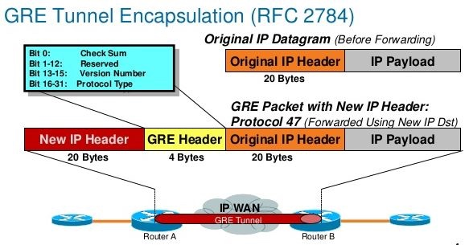

步骤    | 操作/封包        | 协议       | 长度                                           | 备注            
----- | ------------ | -------- | -------------------------------------------- | ----------------        
1     | ping -s 1448 | ICMP     | 1456 = 1448 + 8 （ICMP header）                |  ICMP MSS       
2     | L3           | IP       | 1476 = 1456 + 20 （IP header）                 | GRE Tunnel MTU  
3     | L2           | Ethernet | 1490 = 1476 + 14 （Ethernet header）           | 经过 bridge 到达 GRE
4     | GRE          | IP       | 1500 = 1476 + 4 （GRE header）+ 20 （IP header） |  物理网卡 （IP）MTU   
5     | L2           | Ethernet | 1514 = 1500 + 14 （Ethernet header）           | 最大可传输帧大小        

因此，GRE 的 overhead 是 1514 - 1490 = 24 byte。

可见，使用 GRE 可以比使用 VxLAN 每次可以多传输 1448 - 1422 = 26 byte 的数据。

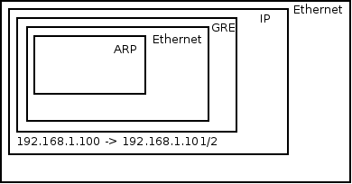

由于GRE没有提供加密和防止窃听的技术，故而经常跟IPSEC一起配合实现对数据的加密传输。

## VXLAN

Virtual eXtensible Local Area Network (VXLAN) 是一种将2层报文封装到UDP包(Mac in UDP)中进行传输的一种封装协议。VXLAN主要是由Cisco推出的，VXLAN的包头有一个24bit的ID段，即意味着1600万个独一无二的虚拟网段，这个ID通常是对UDP端口采取伪随机算法而生成的（UDP端口是由该帧中的原始MAC Hash生成的）。这样做的好处是可以保证基于5元组的负载均衡，保存VM之间数据包的顺序，具体做法是将数据包内部的MAC组映射到唯一的UDP端口组。将二层广播被转换成IP组播,VXLAN使用IP组播在虚拟网段中泛洪而且依赖于动态MAC学习。在VXLAN中，封装和解封的组件有个专有的名字叫做VTEP，VTEP之间通过组播发现对方。

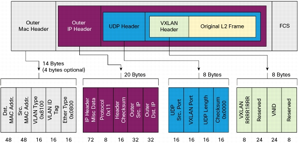
     
步骤    | 操作/封包        | 协议       | 长度                                              | MTU                                   
----- | ------------ | -------- | ----------------------------------------------- | -------------------------------------                         
1     | ping -s 1422 | ICMP     | 1430 = 1422 + 8 （ICMP header）                   |                                      
2     | L3           | IP       | 1450 = 1430 + 20 （IP header）                    | VxLAN Interface 的 MTU                
3     | L2           | Ethernet | 1464 = 1450 + 14 （Ethernet header）              |                                      
4     | VxLAN        | UDP      | 1480 = 1464 + 8 （VxLAN header） + 8 （UDP header） |                                      
5     | L3           | IP       | 1500 = 1480 + 20 （IP header）                    | 物理网卡的（IP）MTU，它不包括 Ethernet header 的长度
6     | L2           | Ethernet | 1514 = 1500 + 14 （Ethernet header）              |  最大可传输帧大小                            

因此，VxLAN 的 overhead 是1514- 1464 = 50 byte。

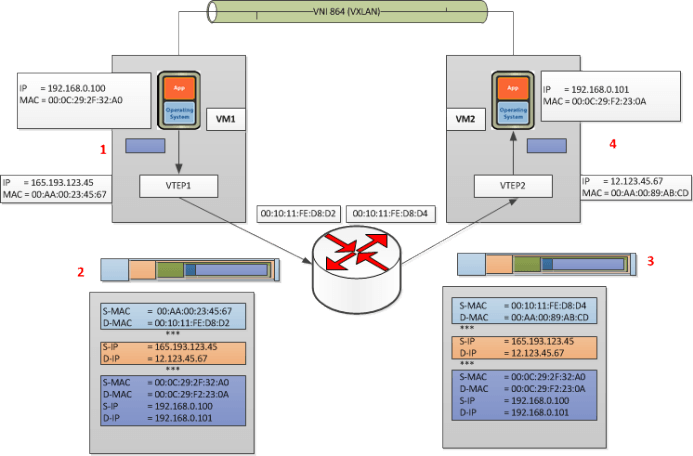

基于组播的 VXLAN 网络其实是没有控制平面的，依赖于数据平面的 flood-and-learn，如果交换机不支持组播的话，将会退化到广播，目前这类的应用已经很少了。为了解决组播的依赖，一种方法是通过 HER 的方法复制报文成单播，这样组播报文或者广播报文可以通过单播复制的形式发送，这种方式被称为 Head-End Replication。Open vSwitch Driver 实现的 VXLAN 即使用类似这种方式避免组播的依赖。HER 在即使有控制平面的情况下依然具备价值，因为有可能有静默主机、MAC 表项老化、虚拟机需要使用组播或广播达成业务的需求。

### VXLAN Offload

一些新型号的网卡(Intel X540 or X710)，具备VXLAN硬件封包／解包能力。开启硬件VXLAN offload，并使用较大的MTU（如9000），可以明显提升虚拟网络的性能。

### 开启或关闭vxlan offload的方法

```
ethtool -k <eth0/eth1> tx-udp_tnl-segmentation <on/off>
```

### VXLAN转发过程

#### 同VXLAN ID内转发

VXLAN最早依靠组播泛洪的方式来转发，但这会导致产生大量的组播流量。所以，在实际生产中，通常使用SDN控制器结合南向协议来避免组播问题。

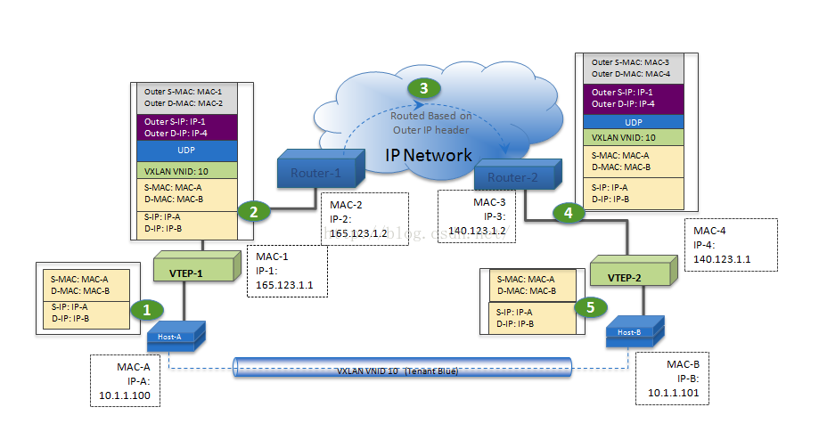
(图片来自[csdn](http://blog.csdn.net/sinat_31828101/article/details/50504656))

#### 不同VXLAN ID转发

大致转发过程与上面类似，所不同的是需要报文在所属vtep或者vxlan gateway处来转换vxlan id（源和目的处都需要做这个转换）。

#### VXLAN与非VXLAN（如VLAN）转发

需要VXLAN Gateway来转换vxlan vni和vlan id：

```
   +---+-----+---+                                    +---+-----+---+
   |    Server 1 |                                    |  Non-VXLAN  |
   (VXLAN enabled)<-----+                       +---->|  server     |
   +-------------+      |                       |     +-------------+
                        |                       |
   +---+-----+---+      |                       |     +---+-----+---+
   |Server 2     |      |                       |     |  Non-VXLAN  |
   (VXLAN enabled)<-----+   +---+-----+---+     +---->|    server   |
   +-------------+      |   |Switch acting|     |     +-------------+
                        |---|  as VXLAN   |-----|
   +---+-----+---+      |   |   Gateway   |
   | Server 3    |      |   +-------------+
   (VXLAN enabled)<-----+
   +-------------+      |
                        |
   +---+-----+---+      |
   | Server 4    |      |
   (VXLAN enabled)<-----+
   +-------------+
```

### MPBGP EVPN VXLAN

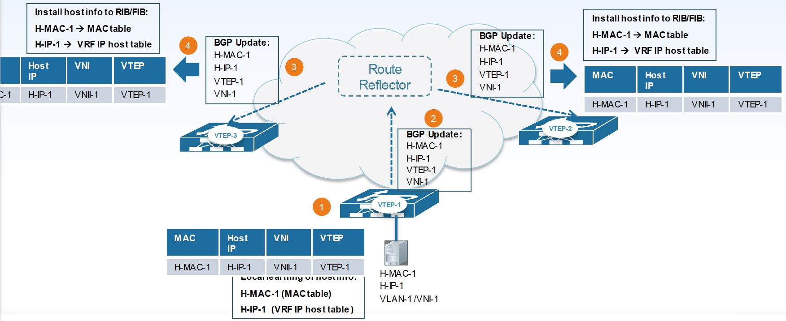


每一个 VTEP 将作为一个 BGP Speaker，向其他 VTEP 通过 EVPN 发送本地的 MAC、IP 信息，BGP RR 可以避免 BGP 的 Full-Mesh，提高通信效率。得益于控制平面，每个 VTEP 将可作为分布式网关、可以抑制 ARP 广播、可以将广播或组播通过单播复制来提升效率、可以对 VTEP 进行认证。

具体到 BGP 租网上，有几种选择，包括 iBGP、eBGP 的选择和外部网络通信。

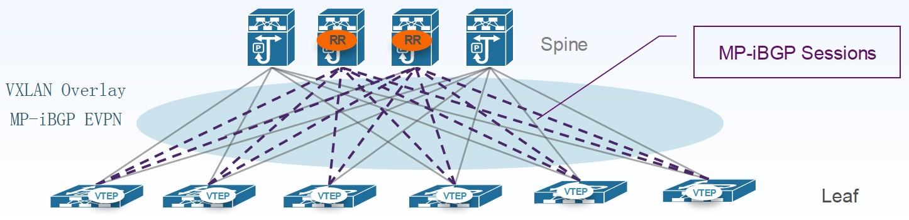


这种模型下 VTEP 只在 Leaf 上，Spine 中选取两个作为 iBGP RR，Spine 不需要作为 VTEP。此外 RR 也可以有多种放置方法，例如在 Leaf 上，这样 Spine 不需要运行 MPBGP EVPN，或者在额外的专门网络设备。

如果是 eBGP，典型的部署方法如下图，好处是 Spine 作为 eBGP Peer，而不是 iBGP RR，Spine，Spine上 的 BGP 需要有对 address-family l2vpn evpn 的转发能力，但不需要支持 VXLAN。所有 Leaf 可以设置各自的 AS，也可以设置为同一 AS，eBGP 运维难度较高，参考设计见 draft-ietf-rtgwg-bgp-routing-large-dc，目前一般较少采用。

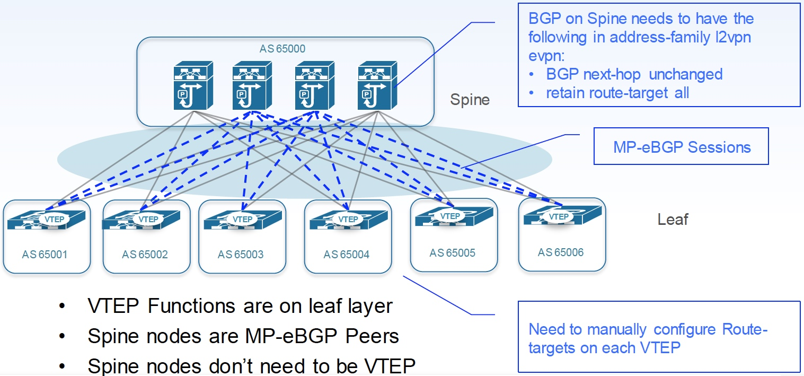

### Distributed Anycast Gateway

IETF 在 draft-ietf-bess-evpn-inter-subnet-forwarding中对在 EVPN 中属于不同的 VxLan 下如何通过 Integrated Routing and Bridging（以下简称 IRB）处理跨子网通信做了说明，换句话说，EVPN VxLan 提供了原生的基于 IRB 的分布式三层网关参考。

然而 EVPN VxLan 的实际路由过程可以分成两步来谈，第一部分是虚拟机的 First-hop 的地址，即网关地址，第二部分是如何在不同 VxLan 间路由（IRB），本节会先谈网关地址的问题。

目前一种实践是使用 Anycast Gateway 技术，每个 VTEP 上均配置相同的 vIP 和 vMAC，如图：

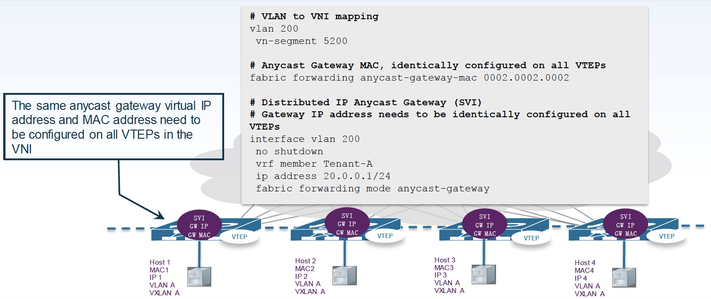


这样首先每个虚拟机的网关都在最近的 VTEP 上，可以优化网络路径，其次当虚拟机发生迁移时，不会需要重新获取默认网关的 ARP。在一些厂商中，这项技术被称为 Static Anycast Gateway。

### Integrated Routing and Bridging

IRB 即 VTEP 提供三层和二层功能，但是对于具体如何路由，目前存在两种方法，分别为 Asymmetric IRB mode 和 Symmetric IRB mode。前者是非对称模式，后者是对称模式，对于 Asymmetric，结合 Anycast Gateway 后路径是这样的：

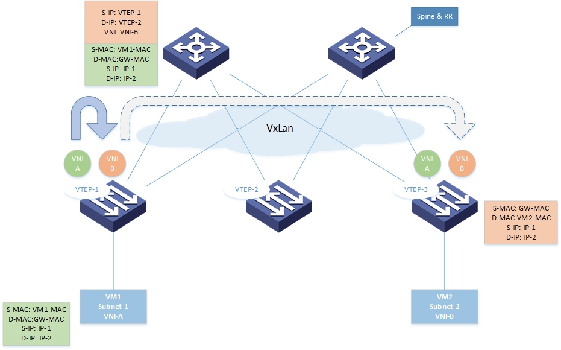


报文由虚拟机发出时，目的 MAC 是网关的虚拟 MAC，VTEP-1 收到报文后查询路由找到 IP-2 对应的虚拟机，查询到对应的 VTEP 为 VTEP-2 后，封上 VxLan 的头部发到 VTEP-2，并将 VNI 设置为对方的 VNI-B，VTEP-2 收到报文后，将 VxLan 头部剥掉换成 Vlan 并发往 VM-2。

当虚拟机需要回复时，路径完全反过来，即在 VTEP-2 上完成 VXLAN 封包和设置 VNI 为 VNI-A。所以这个过程是非对称的。

这种实现存在一些显而易见的问题：

- 所有的 VTEP 必须配置上所有的 VXALN VNI，否则不同 VNI 通信会存在问题；
- 所有的 VTEP 必须获整个 Fabric 完整的 Host tables 信息，否则无法完成完路由。

另一种实现方法是 Symmetric IRB，其实现与 Asymmetric IRB 最显著的不同是源 VTEP 和目标 VTEP 都会承担三层和二层功能，而不像 Symmetric IRB 只在源 VTEP 做路由。这样最终实现是对称的，但前提是必须引入一个新的概念即 L3 VNI。

在 Symmetric IRB 中，每个租户的 VRF 会分配一个 L3 VNI，可达信息（NLDR）会在同一个 L3 VNI 下同步，这样每次路由需要将外层 VXLAN 目的地址设置为目的 VTEP 的地址，将 VNI 设置为 L3 VNI。
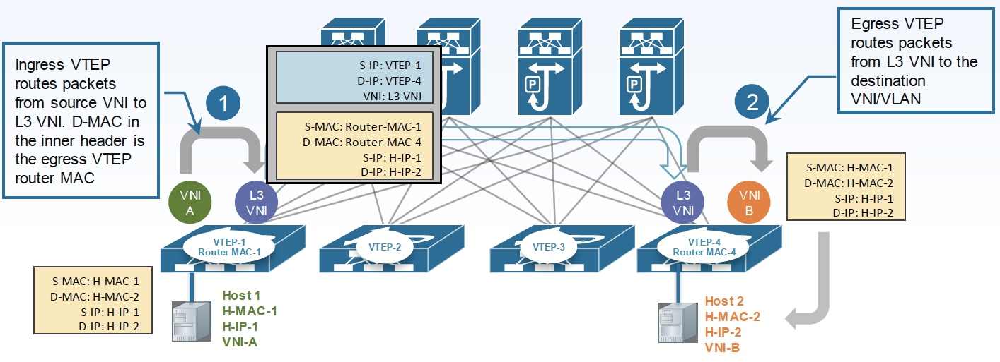


从上面的分析可以得知，Symmetric IRB 最大的好处一是不需要所有 VTEP 均配置所有 VNI，二是不需要所有的 VTEP 知道整个 Fabric 的完整 Host tables 信息。但是，这是建立在不是最差情况的前提，如果说恰好每个租户都在每个 VTEP 下具有虚拟机，或着整个网络只有一个租户，那么网络可能产生退化。Symmetric IRB 的主要优化场景是针对多租户的。

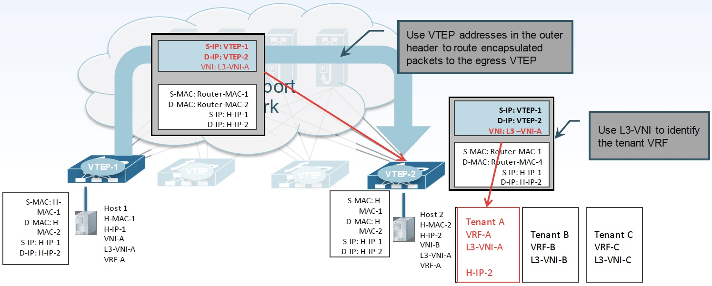

## NVGRE

NVGRE主要支持者是Microsoft。与VXLAN不同的是，NVGRE没有采用标准传输协议（TCP/UDP），而是借助通用路由封装协议（GRE）。NVGRE使用GRE头部的低24位作为租户网络标识符（TNI），与VXLAN一样可以支持1600个虚拟网络。为了提供描述带宽利用率粒度的流，传输网络需要使用GRE头，但是这导致NVGRE不能兼容传统负载均衡，这是NVGRE与VXLAN相比最大的区别也是最大的不足。为了提高负载均衡能力建议每个NVGRE主机使用多个IP地址，确保更多流量能够被负载均衡。

NVGRE不需要依赖泛洪和IP组播进行学习，而是以一种更灵活的方式进行广播，但是这需要依赖硬件/供应商。最后一个区别关于分片，NVGRE支持减小数据包最大传输单元以减小内部虚拟网络数据包大小，不需要要求传输网络支持传输大型帧。

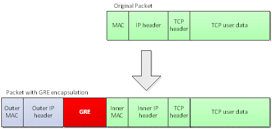

## STT

STT（Stateless Transport Tunneling Protocol）是Nicira提交的隧道协议，类似于VXLAN和VGGRE，它也是把二层的帧封装在一个ip报文的payload中，并在前面增加了tcp头和STT头。注意，STT的tcp头是精心构造出来的，以便利用TSO、LRO、GRO等网卡特性。

## Geneve

Geneve（Generic Network Virtualization Encapsulation）旨在统一VXLAN、NVGRE等各种方案，提供更灵活且适用各种虚拟化场景的通用封装协议。

Geneve使用UDP封包，端口号为6081。

## 参考文档

- https://docs.ustack.com/unp/src/architecture/vxlan.html
- http://www.cisco.com/c/en/us/products/collateral/switches/nexus-9000-series-switches/guide-c07-734107.html
