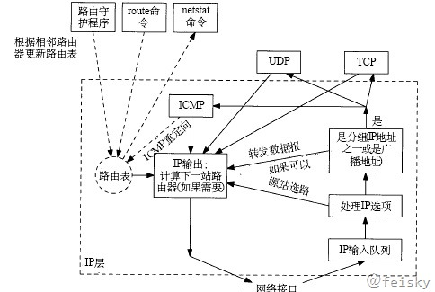

# 路由

## IP选路



1. 搜索路由表的优先级
```
    主机地址
    网络地址
    默认路由
```
2. 路由表
3. 如果找不到匹配的路由，则返回“主机不可达差错”或“网络不可达差错”

一个典型的路由表如下：

```sh
# route -n
Kernel IP routing table
Destination     Gateway         Genmask         Flags Metric Ref    Use Iface
192.168.0.0      0.0.0.0         255.255.192.0   U     0      0        0 eth0
0.0.0.0         192.168.0.1      0.0.0.0         UG    100    0        0 eth0
```

Flags各项的含义：

- U    该路由可用
- G    该路由是一个网关，如果没有该标志，则是直接路由
- H    该路由是一个主机，如果没有该标志，则是一个网络
- D    该路由是由重定向报文创建的
- M    该路由被ICMP重定向报文修改过

## 路由的修改

可以通过route命令来修改路由表，ICMP重定向报文也会修改路由表

一般在系统的配置文件中会设置默认路由.

## ICMP重定向差错

当IP数据报应该被发送到另一个路由器时，收到数据报的路由器就要给发送端回复一个ICMP重定向差错报文。

重定向一般用来让具有很少选路信息的主机逐渐建立更完善的路由表。

## ICMP路由器发现报文

一般来说，主机在引导以后要广播或多播一份路由器请求报文，一台或多台路由器响应一份路由器通告报文。路由器也会定期地广播或多播路由器通告报文。

## 路由协议

- 路由信息协议
- 开放式最短路径协议OSPF
- IS-IS
- 边界网关协议BGP
