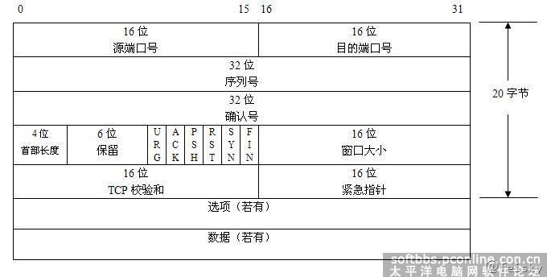
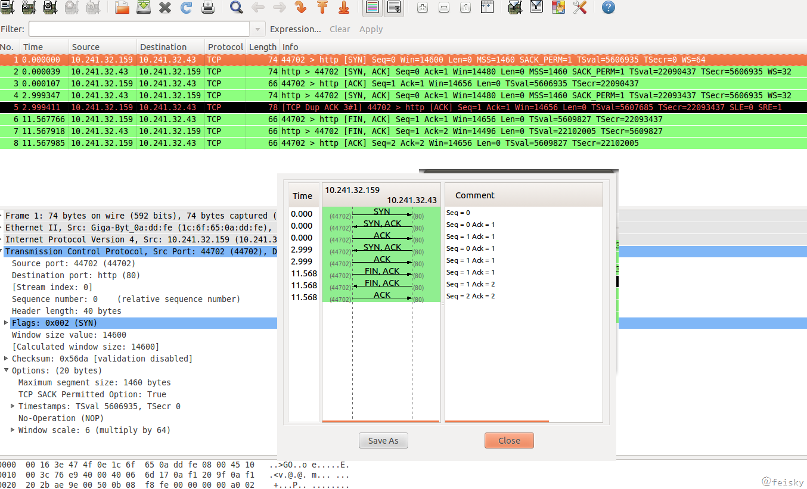
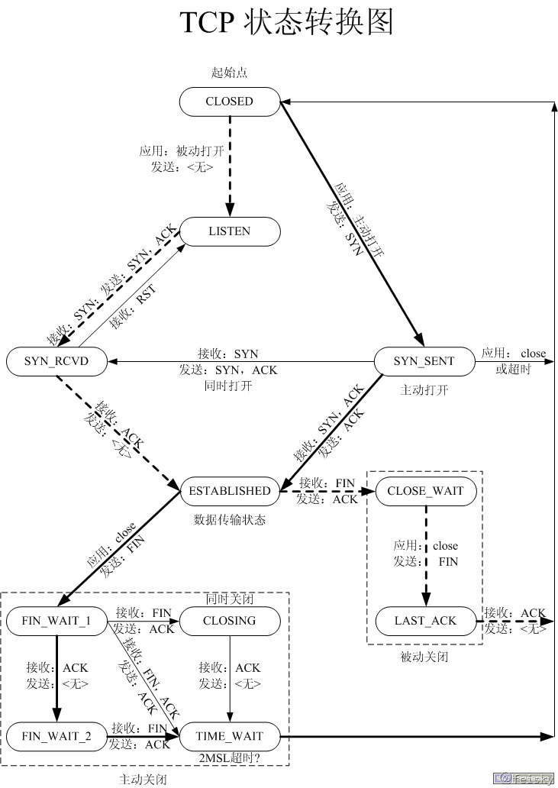

# TCP

TCP的特性

1. TCP提供面向连接的、可靠的字节流服务
2. 上层应用数据被TCP分割为TCP认为合适的报文段
3. TCP使用超时重传机制，而接收到一个TCP数据后需要发送一个确认
4. TCP使用包含了首部和数据的校验和来检查数据是否在传输过程中发生了差错
5. TCP可以将失序的报文重新排序
6. TCP连接的每一端都有固定大小的缓冲区，只允许另一端发送发送接收缓冲区所能接纳的数据
7. TCP提供面向字节流的服务，不在字节流中插入记录标识符，也不对字节流的内容作任何解释（由上层应用解释）

## TCP首部

TCP数据也是封装在IP数据报中，TCP首部格式如下图所示：

其中，

- 序列号：用于对报文进行计数（注SYN和FIN都会消耗一个序列号），TCP为应用层提供全双工服务，连接的每一端都要保持每个方向上的传输序列号
- SYN：用来发起一个连接，当新建一个链接时，SYN变为1
- ACK：确认序号有效，其序列号为上次接收的序号加1
- 首部长度：首部中32bit的长度（最多60字节），如果没有任选字段，长度为20字节
- URG：标志紧急指针有效
- PSH：接收方应该尽快将这个报文交给应用层
- RST：重建连接
- FIN：发端完成发送任务
- 窗口大小：用于TCP的流量控制，最大65535字节
- 检验和：覆盖首部和数据，由发端计算和存储，接收端验证
- 紧急指针：只有当URG为1时才有效，用于发送紧急数据
- 数据部分是可选的，在连接建立和终止时，双方交换的报文中只有TCP首部

TCP可以表述为一个没有选择确认或否认的滑动窗口协议（滑动窗口协议用于数据传输）。我们说TCP缺少选择确认是因为TCP首部中的确认序号表示发方已成功收到字节，但还不包含确认序号所指的字节。当前还无法对数据流中选定的部分进行确认。例如，如果1～1024字节已经成功收到，下一报文段中包含序号从2049～3072的字节，收端并不能确认这个新的报文段。它所能做的就是发回一个确认序号为1025的ACK。它也无法对一个报文段进行否认。例如，如果收到包含1025～2048字节的报文段，但它的检验和错，TCP接收端所能做的就是发回一个确认序号为1025的ACK。

## TCP连接过程

上图由wireshark抓取，并显示了TCP状态图（注意：由于网络阻塞，发生了丢包现象，4是对2的重发，而5是对4的响应（同3相同））。

根据上图可以看到建立一个TCP连接的过程为（三次握手的过程）：

1.  客户端向服务器端发送一个SYN请求，同时传送一个初始序列号（ISN）；
2.  服务器发回包含客户端初始序列号的SYN报文段作为应答，同时将ACK序号设置为ISN+1；
3.  客户端向服务器发送一个ACK确认，ACK序号为ISN+1.

终止一个TCP连接需要4次握手，这是由于TCP的半关闭（当一方调用shutdown关闭连接后，另一端还是可以发送数据，典型的例子为rsh）导致的：TCP连接是全双工的，连接的每一端在关闭连接时都向对方发送一个FIN来终止连接，同时对方会对其进行确认（回复ACK）。通常，都是一方完成主动关闭，另一方来完成被动关闭：

1.  以上面的抓包为例，客户端向服务器发送了一个FIN（NO. 6）；
2.  服务器端对上面的FIN进行确认（NO. 7），同时向客户端发送一个FIN（这儿其实是两个动作，一个是对上面FIN的ACK，另一个是发送一个FIN，但由于TCP的捎带ACK机制，两者放在一个包里发送了）；
3.  客户端对服务器端的FIN进行确认（NO. 8）。

## MSS

最大报文长度（MSS）表示TCP传往另一端的最大块数据的长度。MSS在连接建立时传送给对方，只会出现在SYN报文段中。

MSS让主机限制另一端发送数据报的长度。

## TCP状态变迁图

## 复位报文段

1.  当连接到一个不在监听的端口时，客户端回收到一个RST响应（UDP连接到一个不存在的端口时会产生一个ICMP端口不可达的差错）。
2.  在连接终止时，也可以通过发送一个复位报文段而不是FIN来终止连接，可通过设置SO_LINGER来这么做。
3.  可通过TCP的SO_KEEPALIVE选项来检测半打开连接，当检测到这种连接时会发送一个RST报文。关于该选项更多的内容参见http://www.tldp.org/HOWTO/html_single/TCP-Keepalive-HOWTO/。

**SO_LINGER 选项**

此选项指定函数close对面向连接的协议如何操作（如TCP）。内核缺省close操作是立即返回，如果有数据残留在套接口缓冲区中则系统将试着将这些数据发送给对方。

## Nagle算法
前面可以看到，TCP交互的双方每次发送数据的时候（即便是只有一个字节的数据），都需要产生一个（数据长度+40字节）的分组。当数据的长度远小于40字节时，网络的实际利用率其实很低，并且大量的小分组也会增加拥塞的可能。

Nagle算法正是解决了该问题。它要求一个TCP连接上最多只能有一个未被确认的未完成的小分组，在该分组的确认到达之前不能发送其他的小分组。TCP收集这些小的分组，并在确认到来时以一个分组的形式发出去。其特点是：确认到达的越快，数据也就发送的越快，并可以发送更少的分组。

TCP链接的过程中，默认开启Nagle算法，进行小包发送的优化。优化网络传输，兼顾网络延时和网络拥塞。

Nagle虽然解决了小封包问题，但也导致了较高的不可预测的延迟，同时降低了吞吐量。这个时候可以置位TCP_NODELAY关闭 Nagle算法，有数据包的话直接发送保证网络时效性。

在进行大量数据发送的时候可以置位TCP_CORK关闭Nagle算法保证网络利用性。尽可能的进行数据的组包，以最大mtu传输，如果发送的数据包大小过小则如果在0.6~0.8S范围内都没能组装成一个MTU时，直接发送。如果发送的数据包大小足 够间隔在0.45内时，每次组装一个MTU进行发送。如果间隔大于0.4~0.8S则，每过来一个数据包就直接发送。

Nagle算法和CORK算法非常类似，但是它们的着眼点不一样，Nagle算法主要避免网络因为太多的小包（协议头的比例非常之大）而拥塞，而CORK算法则是为了提高网络的利用率，使得总体上协议头占用的比例尽可能的小。如此看来这二者在避免发送小包上是一致的，在用户控制的层面上，Nagle算法完全不受用户socket的控制，你只能简单的设置TCP_NODELAY而禁用它，CORK算法同样也是通过设置或者清除TCP_CORK使能或者禁用之，然而Nagle算法关心的是网络拥塞问题，只要所有的ACK回来则发包，而CORK算法却可以关心内容，在前后数据包发送间隔很短的前提下（很重要，否则内核会帮你将分散的包发出），即使你是分散发送多个小数据包，你也可以通过使能CORK算法将这些内容拼接在一个包内，如果此时用Nagle算法的话，则可能做不到这一点。

## Keepalive

1. Keepalive定时器用于用于检测空闲连接的另一端是否崩溃或重启。
2. 设置SO_KEEPALIVE选项后，如果2小时内在此套接口的任一方向都没有数据交换，TCP就自动给对方 发一个保持存活探测报文段，客户主机处于以下4种状态之一：
（1）客户主机接收一切正常，服务器收到期望的ACK响应，并将keepalive定时器复位。
（2）客户主机已崩溃，并且关闭或者正在重启。此时，服务器无法收到相应，在75s后超时。服务器=总共发出10个这样的探查，每个间隔75秒。如果一个响应都没有收到，则终止连接。
（3）客户主机已重启，此时服务器将收到一个复位响应，终止连接。
（4）客户主机正常运行，但服务不可达，同（2）。
3. keepalive定时器默认2小时的间隔备受争议，通常应用上需要的时间要比2小时短的多。并且，当系统关闭一个由KEEPALIVE机制检查出来的死连接时，是不会主动通知上层应用的，只有在调用相应的IO操作在返回值中检查出来。因此，如果上层应用需要保活机制，最好还是自己实现。

## TCP的路径MTU探测

- 1)根据自身MTU及对方SYN中携带的MSS确定发送报文数据部分的最大容量（如果对方没有指定MSS，则默认为536）; 
- 2)在IP头部打开DF标志位; 
- 3)如果收到ICMP错误信息告知需要分片, 如果ICMP信息中包含下一跳MTU的信息, 那么根据这个值调整数据的最大容量, 如果ICMP信息中不支持这种新协议(下一跳MTU值为0), 那么调整数据的最大容量至下一个可能的大小; 
- 4)DF标志位会一直打开, 以保证能够测量得到正确的Path MTU; 
- 5)超时后会重新探询Path MTU以保证链路改变也能用到正确的Path MTU.

TCP Path MTU探询的好处是:

- 1)避免在通过MTU小于576的中间链路时进行分片;
- 2)防止中部链路的某些网络的MTU小于通信两端所在网络的MTU时进行分片;
- 3)充分利用链路的吞吐量.

## 长肥管道

带宽延时积很大的网络叫做长肥网络(LFN, long fat network，单位为字节), 在LFN上建立的TCP链接叫做长肥管.

长肥管道带来的一些问题：

- 1）长肥管的带宽延时积很大, TCP头部的窗口大小字段只能最多声明65535(2^16)字节大小的窗口, 因此不能充分利用网络, 由此提出了窗口扩大选项以声明更大的窗口.
- 2）由于长肥管的延时较高, 出现丢包的情况会使得管道枯竭(即网络通信速度急剧下降), 快重传快恢复算法就是用以削弱这一问题的影响, SACK选项也有使用.
- 3）为了提高长肥管的吞吐量, 长肥管一般声明很大的窗口值, 而这样不利于RTT的测量(因为TCP只有一个RTT计时器, 启动RTT计时的数据在没有被ACK前, TCP无法进行下一次RTT的测量, 而由于发送延时一般大于传播延时, 所以TCP往往是发送完一个窗口的数据计算一次RTT), 所以需要引入时间戳选项提高测试RTT的频率.
- 4）由于长肥管的发送速度非常快, 所以导致很短时间内数据的序号就会重复(在gigabit网络只需要34秒就会出现序号重复). 因此引入PAWS算法应对这种情况.

## 超时重传

 1. 对每个连接，TCP管理4个定时器：

（1）重传定时器：用于等待另一端的确认；
（2）persist定时器：用于使窗口大小信息保持不断流动，即使另一端关闭了其接收窗口；
（3）keepalive定时器：用于检测空闲连接的另一端是否崩溃或重启；
（4）2MSL定时器：用于测量一个处于TIME_WAIT状态连接的时间

2. 超时与重传递时间间隔

超时时间可以应用程序设置（SO_RCVTIMEO，SO_SNDTIMEO），而重试的时间采用指数退避的方式，即每次重试的时间间隔为上次的2倍。在目前的实现中，首次分组传输与复位信号传输的时间间隔为9分钟。

3. 往返时间RTT的测量

平滑的RTT估计器：R=alpha*R+(1-alpha)*M，其中alpha=0.9, M是ACK测量到的RTT

重传超时时间的计算:

最初RTO=R*beta, beta=2，但该方法在RTT变化很大时会引起不必要的重传

使用均值和方差来计算RTO：

Err=M-A
A=A+gErr
D=D+h*(|Err|-D)
RTO=A+4D
其中，
A和D分别被初始化为0和3，RTO初始化为A+2D=6
只有数据报文段才会被计时，不对单纯的ACK计时

4. 重传的多义性问题（Karn算法）

当一个超时和重传发生时，在重传数据的确认最后到达之前不能更新RTT估计器，因为我们不知道ACK对应哪次传输。并且，由于数据重传，RTO已经得到一个指数退避，下次传输的时候使用这个退避后的RTO。对一个没有被重传的报文段而言，除非收到了一个确认，否则不计算新的RTO。

5. 拥塞避免算法

慢启动算法是在一个连接上发起数据流的方法，但有时分组回达到中间路由的极限。拥塞避免算法是一种处理丢失分组的方法。该算法假设分组由于损坏引起的丢失是非常少的，因此分组丢失就意味着源主机和目的主机的某处网络发生了拥塞。

有两种分组丢失的指示：发生超时、接收到重复的确认。

拥塞避免算法通常与慢启动算法同时实现，它们需要对每个连接维护两个变量：拥塞窗口cwnd和慢启动门限ssthresh。这样，算法的过程如下：
1) 对一个给定的连接，初始化cwnd为1个报文段，ssthresh为65535个字节。
2) TCP输出例程的输出不能超过 cwnd和接收方通告窗口的大小。拥塞避免是发送方使用的流量控制，而通告窗口则是接收方进行的流量控制。前者是发送方感受到的网络拥塞的估计，而后者则与接收方在该连接上的可用缓存大小有关。
3) 当拥塞发生时（超时或收到重复确认），ssthresh被设置为当前窗口大小的一半（ c w n d和接收方通告窗口大小的最小值，但最少为 2个报文段）。此外，如果是超时引起了拥塞，则cwnd被设置为1个报文段（这就是慢启动）。
4) 当新的数据被对方确认时，就增加cwnd，但增加的方法依赖于我们是否正在进行慢启动或拥塞避免。如果 cwnd小于或等于ssthresh，则正在进行慢启动，否则正在进行拥塞避免。启动一直持续到我们回到当拥塞发生时所处位置的半时候才停止（因为我们记录了在步骤 2中给我们制造麻烦的窗口大小的一半），然后转为执行拥塞避免。

慢启动算法初始设置 cwnd为1个报文段，此后每收到一个确认就加 1。这会使窗口按指数方式增长：发送1个报文段，然后是2个，接着是4个……。

拥塞避免算法要求每次收到一个确认时将 cwnd增加1 /cwnd。与慢启动的指数增加比起来，这是一种加性增长(additive increase)。我们希望在一个往返时间内最多为cwnd增加1个报文段（不管在这个RT T中收到了多少个ACK），然而慢启动将根据这个往返时间中所收到的确认的个数增加cwnd。

术语“慢启动”并不完全正确。它只是采用了比引起拥塞更慢些的分组传输速率，但在慢启动期间进入网络的分组数增加的速率仍然是在增加的。只有在达到ssthresh拥塞避免算法起作用时，这种增加的速率才会慢下来。

6. 快速重传算法

拥塞避免算法的修改建议1 9 9 0年提出 [Jacobson 1990b]。
在介绍修改之前，我们认识到在收到一个失序的报文段时， TCP立即需要产生一个ACK（一个重复的ACK）。这个重复的ACK不应该被迟延。该重复的ACK的目的在于让对方知道收到一个失序的报文段，并告诉对方自己希望收到的序号。
由于我们不知道一个重复的ACK是由一个丢失的报文段引起的，还是由于仅仅出现了几个报文段的重新排序，因此我们等待少量重复的ACK到来。假如这只是一些报文段的重新排序，则在重新排序的报文段被处理并产生一个新的ACK之前，只可能产生1 ~ 2个重复的ACK。
如果一连串收到3个或3个以上的重复ACK，就非常可能是一个报文段丢失了。于是我们就重传丢失的数据报文段，而无需等待超时定时器溢出。这就是快速重传算法。接下来执行的不是慢启动算法而是拥塞避免算法。这就是快速恢复算法。

7. TCP连接对ICMP差错的处理

（1）ICMP源站抑制差错：将拥塞窗口cwnd设为1个报文段大小发起慢启动，但是慢启动门限ssthresh没有变化；
（2）主机不可达或网络不可达差错：忽略，因为这两个差错通常被认为是暂时的。

8. 重新分组

当tcp重传的时候，不一定要重新传输相同的报文段。实际上，TCP允许进行重新分组而发送一个较大的报文段，这有助于提升性能。

## 滑动窗口

1. 滑动窗口协议允许发送方在停止并等待确认前可以连续发送多个分组，由于发送方不必每发一个分组就停下来等待确认，因此该方法可以加速数据的传输。

2. 滑动窗口

窗口大小表示接收端的TCP协议缓存中还有多少剩余空间，用于接收端的流量控制

特点：

（1）发送方不必发送一个全窗口的大小
（2）来自接收方的一个报文段确认数据并把窗口向右滑动（窗口大小是相对于确认序号的）
（3）窗口的大小可以减小，但窗口的右边不能向左移动
（4）接收方在发送一个ACK前不必等待窗口被填满

窗口更新：一个ACK分组，但不确认任何数据（分组中的序号已被前面的ACK确认），只是通知对方窗口大小已变化

3. PUSH标志

发送方使用该标志通知接收方将所收到的数据全部交给接收进程，这标志着发送方暂时没有更多的数据要发送了

4. 慢启动

慢启动为TCP增加一个拥塞窗口（cwnd），刚建立连接时cwnd初始化为一个报文段的大小（由另一端通告），其后每收到一个ACK，cwnd就增加一个报文段大小。发送方取拥塞窗口与通告窗口中的最小值作为发送上限。

拥塞窗口是发送方使用的流量控制，而通告窗口是接收方使用的流量控制。

5. URG标志

紧急标志用于发送端通知接收端分组中包含了紧急数据，具体如何处理由接收方确定

紧急数据也被成为带外数据

6. 带宽时延积

带宽：单位时间内从发送端到接收端所能通过的“最高数据率”
RTT：从发送端到接收端的一去一回需要的时间
带宽时延乘积：等于带宽*RTT，实际上就是发送端到接收端单向通道的数据容积的两倍

设带宽为B，RTT为Tr，滑动窗口为W，则：

（1）W<B*Tr时，影响TCP发送数据速率的最直接的因素是滑动窗口的大小，TCP的流量控制策略（比如超时时窗口设置为1，重复ACK时窗口减半）最终都是通过控制窗口大小来控制速率，而慢启动，拥塞避免这些流量控制算法实际上就是控制窗口增长方式的算法，也就是控制的是加速度大小。
（2）当W>B*Tr时，则影响速率的因素是带宽

## 参考文档

- [tcpip详解笔记](http://www.cnblogs.com/feisky/archive/2012/10/23/2735680.html)