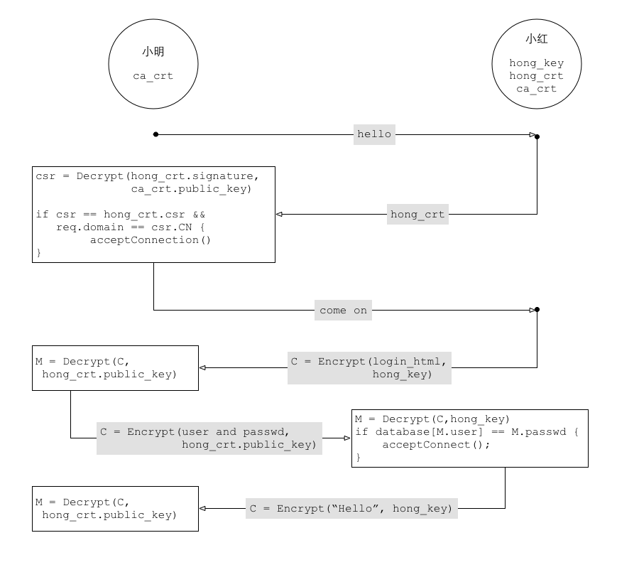
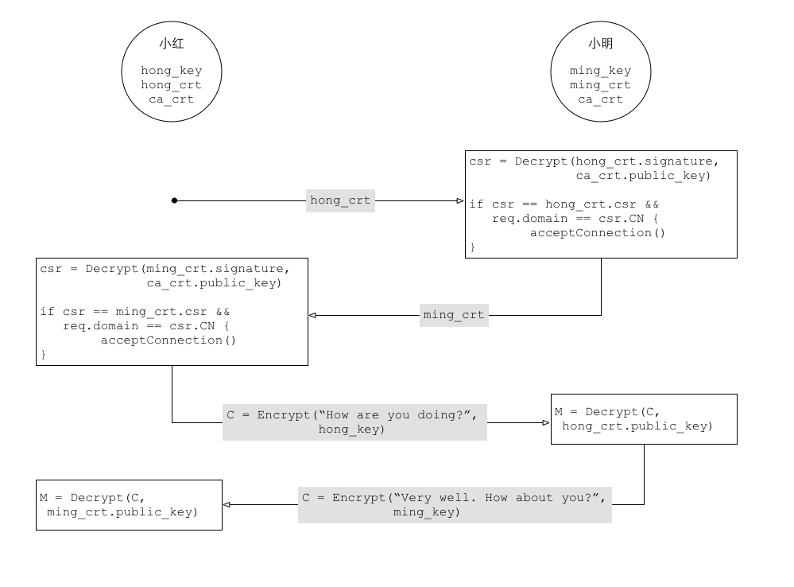

## 加密技术

TLS 依赖两种加密技术：

1. 对称加密（symmetric encryption）
2. 非对称加密（asymmetric encryption）


## 对称加密

对称加密的一方（比如小红）用秘钥 K 给文本 M 加密；另一方（比如小明）用
同一个秘钥解密：

```
小红 : C = E(M, K)
小明 : M = D(C, K)
```

这有一个问题：当一方生成了秘钥 K 之后得把 K 分享给另一方。但是穿越 Sin
City 的道路危险中途很可能有人窃听到 K，窃听者就可以假扮双方中的任何一
方与另一方通信。这叫中间人攻击<sup>[mim](#mim)</sup>。


## 非对称加密

非对称加密利用成对的两个秘钥：K1 和 K2。小红用其中一个加密文本，小明可
以用另一个解密文本。比如，小红用 K1 加密，小明用 K2 解密：

```
小红 : C = E(M, K1)
小明 : M = D(C, K2)
```

这样一来，双方中的一方（比如小红）可以生成 K1和K2，然后把其中一个秘钥
（比如K1）私藏，称为*私钥*；另一个（比如K2）公开，称为*公钥*。另一
方（比如小明）得到公钥之后，双方就可以通信。

然并卵，中间人还是可能截获公钥 K2，然后自己弄一对秘钥（κ1, κ2），然后
告诉小明说 κ2 是小红的公钥。这样中间人每次可以用截获的 K2 解密小红发给
小明的文本（甚至可能修改文本），再用 κ1 加密了发出去；小明用 κ2 解密接
收。

[这里](./openssl.html#生成RSA秘钥对)有一个用OpenSSL工具生成密钥对的例子。


## 数字签名和CA

为了帮小明确定得到的公钥确实是小红的 K2，而不是中间人伪造的 κ2，牛人们
发明了*数字签名（digital signature）*技术。

数字签名的做法是：

1. 小红把自己的公钥和ID（身份证号码，或者域名）合为*身份证申请（certificate signing request，CSR）*，
1. 小红把CSR发给一个德高望重的人（被称为 certificate authority，CA），比如小亮，
1. 小亮用自己的私钥加密小红的 CSR，得到的密文被称为*数字签名（digital signature）*，
1. 小亮把 signature 和 CSR 的明文合在一起称为 *CA签署的身份证（CA signed certificate，CRT）*，发给小红，

```
小红：CSR = 小红公钥+小红域名
     signature = E(CSR, 小亮的私钥)
     CRT = CSR + signature
```

[这里](./openssl.html#生成身份证申请)有一个用OpenSSL生成CSR的例子。 签署
CSR的例子在[这里](./openssl.html#签署身份证)。

每当其他人（比如小明）找小红聊天（建立HTTPS连接）的时候，小红出示自己的小亮签署的身份证。
拿到这个身份证的人，只要他是相信小亮的——在自己机器上安装了小亮的身份证，就可以

1. 从小亮的身份证中的小亮的CSR里提取小亮的公钥；
1. 然后用小亮的公钥解密小红的身份证中小亮的signature，得到一个小红的CSR'；
1. 如果这个CSR'和小红身份证中的CSR明文一致，则说明“这个小红的身份证是小亮确认过并且签名的”。

```
小明：小亮的公钥 = 小亮的CRT.CSR.小亮的公钥
     CSR' = D(CRT.signature, 小亮的公钥)
     if CSR' == CRT.CSR then OK
```

由此过程可以看出来：随便谁都可以当CA——只要愿意公开自己的公钥，即可用自
己的私钥去加密别人的认证。那我们要是信错了 CA，被他摆一道怎么办？答案
是：没办法。我们选择信任社会，要相信如果 CA 说谎，万一被识破，就没有人
再相信他了。现实中，很多操作系统（Windows、Mac OS X）和浏览器（Chrome、
Firefox、IE）会内置一些靠谱的 CA 的身份证。但是有没有 CA 冒天下之大不
韪说谎呢？据传说有一个自称 CNNIC 的机构说过谎。

这个过程可以用下图描述：

<a name=single-directional>

</a>

请注意，这只是一个示意图，并不为了精准描述HTTPS协议的握手和通信过程。
图中省略了一些重要的细节，比如握手之后的实际通信都是采用
[对称加密技术来实现的](#加密和解密的性能)。


## 信任链

小亮如果担心没有人信任自己是个好 CA（就像没人信CNNIC一样），可以找一个
大家都信的 CA，比如老王，用老王的私钥在小亮的身份证上签名：

```
小亮：CSR = 小亮的公钥+小亮域名
     signature = E(CSR, 老王的私钥)
     CRT = CSR + signature
```

如果浏览器或者操作系统里安装了老王的公钥则可以验证“小亮的身份证是老王
确认并且签名过的”。

这样，小亮在签署小红的身份证的时候，可以在小红身份证后面附上自己的身份
证。这样小红的身份证就有“两页”了。

当小明和小红通信的时候：

1. 小明会先要求小红出示自己的身份证；
1. 小明虽然不信任小亮，但是信任老王，所以小明可以用老王的身份证里的老
   王的公钥来验证小红身份证附带的小亮的身份证，于是就可以信任小亮了；
1. 然后小明用小亮身份证里的公钥验证小红的身份证。

要是怕小明连自己也也不信任，老王可以再找一个小明信任的人来签名确认自己
的身份证。这个过程可以不断递推，从而形成了一条信任链（trust of
chain)<sup>[chain](#chain)</sup>。


## 根身份证和自签名

信任链总会有个顶端，被称为*根身份证（root CA）*。那么根身份证是谁签名
的呢？答案是：自己签名。实际上，我们每个人都可以自己签名认证自己的身份
证，得到*自签名的身份证（self-signed certificate）*。具体过程是：

1. 生成一对秘钥：公钥 K2 和私钥 K1，
2. 创建自己的 CSR，
3. 用自己的秘钥加密CSR得到signature，然后把CSR明文和signature一起发布。

任何人只要信任我们自签名的身份证 CRT，也就可以用 CRT.CSR.K2 作为公钥加
密要传递给我们的文本。我们可以用自己的私钥 K1 来解密文本。

如果老王就是根CA了，那么上述各位的身份证的信任链如下：

```
小红：CSR = 小红公钥+小红域名
     signature = E(CSR, 小亮的私钥)
     CRT = CSR + signature

小亮：CSR = 小亮的公钥+小亮域名
     signature = E(小亮的CSR, 老王的私钥)
     CRT = 小亮的CSR + signature

老王：CSR = 老王的公钥+老王的域名
     signature = E(老王的CSR, 老王自己的私钥)
     CRT = 老王的CSR + signature
```

[这里](./openssl.html#签署身份证)有一个用OpenSSL工具自签署身份证的例子，
以及一个用自己创建的根身份证签署其他身份证的例子。

## 双方TLS认证

上述例子解释了通信的一方如何验证另一方的身份。这种情况的一个常见应用是：
我们通过浏览器访问银行的网页。这里的关键是，我们要能验证银行的身份证，
然后才敢于在网页里输入账号和密码。浏览器验证银行的身份证的过程如下：

1. 在浏览器和银行的HTTPS服务建立安全连接的过程中，银行的HTTPS服务会把
   它的身份证发给浏览器<sup>[showcerts](./openssl.html#showcerts)</sup>；
1. 浏览器使用内置的CA的身份证来验证银行的身份证。

浏览器验证了银行的HTTPS服务的身份之后，就轮到银行验证浏览器的用户的身份了：

1. 浏览器展示银行HTTPS服务发来的登陆页面；
1. 用户在这个页面里输入账号和密码，银行的HTTPS服务由此验证用户的身份。

在这个过程中，银行HTTPS服务器的身份是通过TLS身份证来验证的。而我们（用
户）的身份是通过我们输入的账号和密码来验证的。

有时通信的双方都是程序（而不是人）。此时，让一方输入账号和密码，不如让
双方都通过TLS身份证来互相验证方便。尤其是在很多分布式系统里，有多种类
型的程序互相通信，而不只是两方通信。

比如在 Kubernetes 集群里，不光操作集群的客户端程序 kubectl 要能验证
Kubernetes master node（具体的说是 apiserver）的身份，才能放心地把包括
敏感信息（比如数据库密码）的计算作业提交给 apiserver。类似的，
apiserver也要能验证 kubectl 的身份，以确认提交作业的是公司的合法雇员，
而不是外贼<sup>[sign](#sign)</sup>。

为此，通信各方都需要有各自的身份证。一个公司可以自签名一个CA身份证，并
且用它来给每个雇员以及每个程序签署身份证。这样，只要每台电脑上都预先安
装好公司自己的CA身份证，就可以用这个身份证验证每个雇员和程序的身份了。
这是目前很多公司的常用做法。

双向认证和通信的过程请参见下图

<a name=bidirectional>

</a>


## 加密和解密的性能

因为TLS模式下所有传输的数据都是加密的，大家会关注加密和解密的性能。客
观的说，非对称加密技术的加密和解密比较慢，相对来说，对称加密技术的加密
解密过程更快。所以实际的连接和握手过程中，通信双方会协商一个对称加密秘
钥，之后的数据通信过程中的加密都是利用对称加密技术来实现的。

具体的做法是：握手的时候，双方各自生成一个随机数，并且以非对称加密的方式
分享给对方。然后每一方都把自己的随机数和对方的随机数拼起来，就是接下来
通信时候使用的对称加密方法的秘钥了。

## 下一步

上面介绍的概念在实际操作中往往是靠开源工具 `openssl` 实现的。
[下一篇](./openssl.html)介绍如何使用 `openssl`。

## 参考文献

- <a name=mim>mim</a> https://en.wikipedia.org/wiki/Man-in-the-middle_attack

- <a name=chain>chain</a> https://en.wikipedia.org/wiki/Chain_of_trust

- <a name=sign>sign</a> https://coreos.com/kubernetes/docs/latest/openssl.html#kubernetes-api-server-keypair
