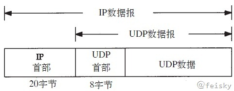
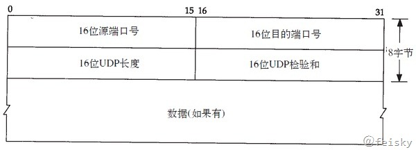
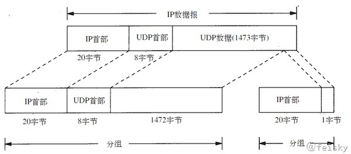

# UDP、DHCP与DNS

## UDP

UDP是一种对象数据报的传输层协议，它不提供可靠性，其数据报被封装在IP数据报中，封装格式如下图所示：

首部格式为

* 源端口号和目的端口号分表表示了发送进程和接收进程
* UDP长度字段包括了UDP首部和UDP数据的字节长度
* UDP检验和覆盖了UDP首部和UDP数据（IP首部检验和只覆盖了IP首部，不覆盖数据报中的任何数据）
* UDP数据报的长度可以为奇数字节，但是检验和算法是把若干个16bit字相加。解决方法是必要时在最后增加填充字节0，这只是为了检验和的计算。UDP数据报和TCP段都包含一个12字节长的伪首部，它是为了计算检验和而设置的。伪首部包含IP首部一些字段。

## IP分片

以太网和802.3对数据帧的长度都有一个限制，其最大值分别是1500和1492个字节。链路层的这个特性称作MTU。不同类型的网络大多数都有一个上限。如果IP层有一个数据要传，且数据的长度比链路层的MTU还大，那么IP层就要进行分片（fragmentation），把数据报分成若干片，这样每一个分片都小于MTU。当IP数据报被分片后，每一片都成为一个分组，具有自己的IP首部，并在选择路由时与其他分组独立。

把一份IP数据报进行分片以后，由到达目的端的IP层来进行重新组装，其目的是使分片和重新组装过程对
运输层（TCP/UDP）是透明的。由于每一分片都是一个独立的包，当这些数据报的片到达目的端时有可能会失序，但是在IP首部中有足够的信息让接收端能正确组装这些数据报片。

尽管IP分片过程看起来透明的，但有一点让人不想使用它：即使只丢失一片数据也要重新传整个数据报。

why？因为IP层本身没有超时重传机制------由更高层（比如TCP）来负责超时和重传。当来自TCP报文段的某一片丢失后，TCP在超时后会重发整个TCP报文段，该报文段对应于一份IP数据报（而不是一个分片），没有办法只重传数据报中的一个数据分片。

使用UDP很容易导致IP分片，TCP试图避免IP分片。那么TCP是如何试图避免IP分片的呢？其实说白了，
采用TCP协议进行数据传输是不会造成IP分片的，因为一旦TCP数据过大，超过了MSS，则在传输层会对
TCP包进行分段（如何分，见下文！），自然到了IP层的数据报肯定不会超过MTU，当然也就不用分片了
。而对于UDP数据报，如果UDP组成的IP数据报长度超过了1500，那么IP数据报显然就要进行分片，因为
UDP不能像TCP一样自己进行分段。

MSS（Maxitum Segment Size）最大分段大小的缩写，是TCP协议里面的一个概念

* 1）MSS就是TCP数据包每次能够传输的最大数据分段。为了达到最佳的传输效能TCP协议在
建立连接的时候通常要协商双方的MSS值，这个值TCP协议在实现的时候往往用MTU值代替（需要减去IP
数据包包头的大小20Bytes和TCP数据段的包头20Bytes）所以往往MSS为1460。通讯双方会根据双方提
供的MSS值得最小值确定为这次连接的最大MSS值。
* 2）相信看到这里，还有最后一个问题：TCP是如何实现分段的呢？其实TCP无所谓分段，因为每
个TCP数据报在组成前其大小就已经被MSS限制了，所以TCP数据报的长度是不可能大于MSS的，当然由
它形成的IP包的长度也就不会大于MTU，自然也就不用IP分片了。

* 发生ICMP不可达差错的另一种情况是，当路由器收到一份需要分片的数据报，而在IP首部又设置了不分片（DF）的标志比特。如果某个程序需要判断到达目的端的路途中最小MTU是多少—称作路径MTU发现机制，那么这个差错就可以被该程序使用。
* 理论上，UDP数据的最大长度为：65535-20字节IP首部长度-8字节UDP首部长度=65507。但是大多是实现都比这个值小，主要是受限于socket接口以及TCP/IP内核的限制。大部分系统都默认提供了可读写大于8192字节的UDP数据报。
* 当目标主机的处理速度赶不上数据接收的速度，因为接受主机的IP层缓存会被占满，所以主机就会发出一个ICMP源站抑制差错报文。

## DHCP

DHCP（Dynamic Host Configuration Protocol）是一个用于主机动态获取IP地址的配置解析，使用UDP报文传送，端口号为67何68。

DHCP使用了租约的概念，或称为计算机IP地址的有效期。租用时间是不定的，主要取决于用户在某地连接Internet需要多久，这对于教育行业和其它用户频繁改变的环境是很实用的。通过较短的租期，DHCP能够在一个计算机比可用IP地址多的环境中动态地重新配置网络。DHCP支持为计算机分配静态地址，如需要永久性IP地址的Web服务器。

## DNS

DNS（Domain Name System）是一个解析域名和IP地址对应关系的服务，它以递归的方式运行：首先访问最近的DNS服务器，如果查询到域名对应的IP地址则直接返回，否则的话再向上一级查询。DNS通常以UDP报文来传送，并使用端口号53。

DNS是一种用于TCP/IP应用程序的分布式数据库，提供主机名字和IP地址之间的转换以及有关电子邮件的选路信息。从应用的角度来看，其实就是两个库函数gethostbyname()和gethostbyaddr()。

> FQDN：全域名(FQDN，Fully Qualified Domain Name)是指主机名加上全路径，全路径中列出了序列中所有域成员(包括root)。全域名可以从逻辑上准确地表示出主机在什么地方，也可以说全域名是主机名的一种完全表示形式。

**资源记录（RR）**

- A记录：  用于查询IP地址
- PTR记录：  逆向查询记录，用于从IP地址查询域名
- CNAME：  表示“规范名字”，用来表示一个域名，也通常称为别名
- HINFO：  表示主机信息，包括主机CPU和操作系统的两个字符串
- MX：  邮件交换记录
- NS：  名字服务器记录，即下一级域名信息的服务器地址，只能设置为域名，不能是IP

**高速缓存**

为了减少DNS的通信量，所有的名字服务器均使用高速缓存。在标准Unix是实现中，高速缓存是由名字服务器而不是名字解释器来维护的。

**用UDP还是TCP**

DNS服务器支持TCP和UDP两种协议的查询方式，而且端口都是53。而大多数的查询都是UDP查询的，一般需要TCP查询的有两种情况：

1. 当查询数据多大以至于产生了数据截断(TC标志为1)，这时，需要利用TCP的分片能力来进行数据传输（看TCP的相关章节）。 
2. 当主（master）服务器和辅（slave）服务器之间通信，辅服务器要拿到主服务器的zone信息的时候。

## FAQ

### dnsmasq bad DHCP host name 问题

这个问题是由于hostname是数字前缀，并且dnsmasq对版本低于2.67，这个问题在[2.67版本中修复](http://www.thekelleys.org.uk/dnsmasq/CHANGELOG):

>   Allow hostnames to start with a number, as allowed in
>   RFC-1123. Thanks to Kyle Mestery for the patch. 
