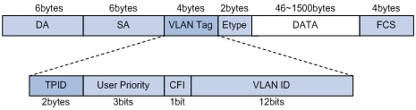

# VLAN

LAN 表示 Local Area Network，本地局域网，通常使用 Hub 和 Switch 来连接 LAN 中的计算机。 一个 LAN 表示一个广播域，它的意思是 LAN 中的所有成员都会收到 LAN 中一个成员发出的广播包。 因此，LAN 的边界在路由器或者类似的三层设备。

VLAN 表示 Virtual LAN。一个带有 VLAN 功能的 Switch 能够同时处于多个 LAN 中。简单的说， VLAN 是一种将一个交换机分成多个交换机的一种方法。

IEEE 802.1Q 标准定义了 VLAN Header 的格式。它在普通以太网帧结构 SA （src address）之后 加入了 4bytes 的 VLAN Tag/Header 数据，其中包括 12bits 的 VLAN ID。VLAN ID的最大值是 4096， 但是有效值范围是 1- 4094。

## 交换机端口类型

以太网端口有三种链路类型：

- Access：只能属于一个 VLAN，一般用于连接计算机的端口
- Trunk：可以属于多个 VLAN，可以接收和发送多个 VLAN 的报文，一般用于交换机之间连接的接口

Hybrid：属于多个 VLAN，可以接收和发送多个 VLAN 报文，既可以用于交换机之间的连接，也可以 用户连接用户的计算机。 Hybrid 端口和 Trunk 端口的不同之处在于 Hybrid 端口可以允许多个 VLAN 的报文发送时不打标签，而 Trunk 端口只允许缺省 VLAN 的报文发送时不打标签。

## VLAN 的不足

- VLAN 使用 12-bit 的 VLAN ID，因此第一个不足之处就是最多只支持 4096 个 VLAN 网络
- VLAN 是基于 L2 的，因此很难跨越 L2 的边界，限制了网络的灵活性
- VLAN 的配置需手动介入较多

## QinQ

QinQ是为了扩大VLAN ID的数量而提出的技术（IEEE 802.1ad），外层tag称为Service Tag，而内层tag则称为Customer Tag。

参考文档

- http://www.cnblogs.com/sammyliu/p/4626419.html
- https://docs.ustack.com/unp/src/architecture/vlan.html
