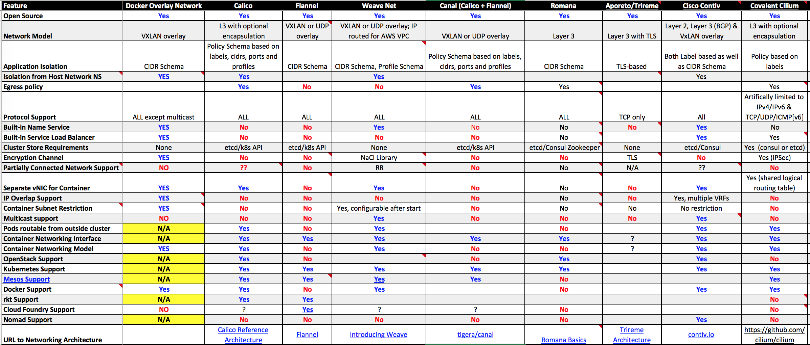

# 容器网络

本章介绍Kubernetes的网络模型以及常见插件的原理和使用方法，主要包括

- Host Network：最简单的网络模型就是让容器共享Host的network namespace，使用宿主机的网络协议栈。这样，不需要额外的配置，容器就可以共享宿主的各种网络资源。
- 共享容器网络：多个容器共享同一个netns，只需要第一个容器配置网络。比如Kubernetes Pod就是所有容器共享同一个pause容器的网络。
- Docker主推的CNM（Container network model）：是Docker的网络模型，主要由Sandbox、Network以及Endpoint组成。
- CNCF主推的CNI（Container Network Interface）：CNI是由CoreOS发起的容器网络规范，是Kubernetes网络插件的基础。其基本思想为：Container Runtime在创建容器时，先创建好network namespace，然后调用CNI插件为这个netns配置网络，其后再启动容器内的进程。目前已经贡献给CNCF，将成为CNCF主推的网络模型。
- Kubernetes网络模型：IP-Per-Pod网络模型，基于CNI的网络插件，并基于CNI bridge实现了kubenet网络插件。

常见的容器网络插件对比：

(来自[Container Native Networking - Comparison](https://docs.google.com/spreadsheets/d/1polIS2pvjOxCZ7hpXbra68CluwOZybsP1IYfr-HrAXc/edit#gid=0))

