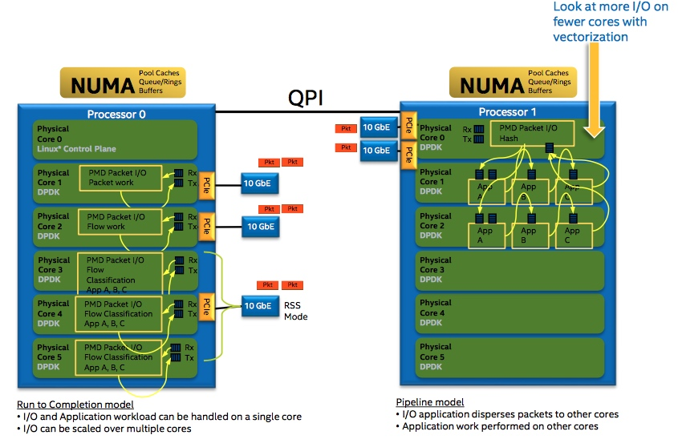

# PCIe

PCI Express（Peripheral Component Interconnect Express）又称PCIe，它是一种高速串行通信互联标准。PCIe规范遵循开放系统互联参考模型（OSI），自上而下分为事务传输层、数据链路层、物理层。对于特定的网卡，PCIe一般作为处理器外部接口。一般网卡采用DMA控制器通过PCIe Bus访问内存，除了对以太网数据内容的读写外，还有DMA描述符操作相关的读写，这些操作也由MRd/MWr来完成。

PCIe包格式示例，对于一个完整的TLP包来说，除去有效载荷，额外还有24B的开销（TLP头部以16B计算）。

要查看特定PCIe设备的链路能力和当前速率，可以用Linux工具lspci读取PCIe的配置寄存器。

## 网卡DMA描述符环形队列

DMA（Direct Memory Access，直接存储器访问）是一种高速的数据传输方式，允许在外部设备和存储器之间直接读写数据。数据既不通过CPU，也不需要CPU干预。整个数据传输操作在DMA控制器的控制下进行。网卡DMA控制器通过环形队列与CPU交互。环形队列的内容部分位于主存中，控制部分通过访问外设寄存器的方式完成。

## 转发操作

优化的考虑

（1）减少MMIO访问的频度。接收包时，尾寄存器（tail register）的更新发生在新缓冲区分配以及描述符重填之后。只要将每包分配并重填描述符的行为修改为滞后的批量分配并重填描述符，接收侧的尾寄存器更新次数将大大减少。DPDK是在判断空置率小于一定值后才触发重填来完成这个操作的。发送包时，就不能采用类似的方法。因为只有及时地更新尾寄存器，才会通知网卡进行发包。但仍可以采用批量发包接口的方式，填充一批等待发送的描述符后，统一更新尾寄存器。
（2）提高PCIe传输的效率。如果能把4个操作合并成整Cache Line大小来作为PCIe的事务请求（PCIe净荷为64Byte），带宽利用率就能得到提升。
（3）尽量避免Cache Line的部分写。Cache Line的部分写会引发内存访问read-modify-write的合并操作，增加额外的读操作，也会降低整体性能。所以，DPDK在Mempool中分配buffer的时候，会要求对齐到Cache Line大小。

> 每转发一个64字节的包的平均转发开销接近于168字节（96+24+8+8+32）。如果计算包转发率，就会得出64B报文的最大转发速率为4000MB/s/168B=23.8Mp/s。

## Mbuf

为了高效访问数据，DPDK将内存封装在Mbuf（struct rte_mbuf）结构体内。Mbuf主要用来封装网络帧缓存，也可用来封装通用控制信息缓存（缓存类型需使用CTRL_MBUF_FLAG来指定）。网络帧元数据的一部分内容由DPDK的网卡驱动写入。这些内容包括VLAN标签、RSS哈希值、网络帧入口端口号以及巨型帧所占的Mbuf个数等。对于巨型帧，网络帧元数据仅出现在第一个帧的Mbuf结构中，其他的帧该信息为空。

单帧结构

巨型帧结构

## Mempool

在DPDK中，数据包的内存操作对象被抽象化为Mbuf结构，而有限的rte_mbuf结构对象则存储在内存池中。内存池使用环形缓存区来保存空闲对象。

当一个网络帧被网卡接收时，DPDK的网卡驱动将其存储在一个高效的环形缓存区中，同时在Mbuf的环形缓存区中创建一个Mbuf对象。当然，两个行为都不涉及向系统申请内存，这些内存已经在内存池被创建时就申请好了。Mbuf对象被创建好后，网卡驱动根据分析出的帧信息将其初始化，并将其和实际帧对象逻辑相连。对网络帧的分析处理都集中于Mbuf，仅在必要的时候访问实际网络帧。这就是内存池的双环形缓存区结构。为增加对Mbuf的访问效率，内存池还拥有内存通道/Rank对齐辅助方法。内存池还允许用户设置核心缓存区大小来调节环形内存块读写的频率。

实践证明，在内存对象之间补零，以确保每个对象和内存的一个通道和Rank起始处对齐，能大幅减少未命中的发生概率且增加存取效率。在L3转发和流分类应用中尤为如此。内存池以更大内存占有量的代价来支持此项技术。在创建一个内存池时，用户可选择是否启用该技术。

多核CPU访问同一个内存池或者同一个环形缓存区时，因为每次读写时都要进行Compare-and-Set操作来保证期间数据未被其他核心修改，所以存取效率较低。DPDK的解决方法是使用单核本地缓存一部分数据，实时对环形缓存区进行块读写操作，以减少访问环形缓存区的次数。单核CPU对自己缓存的操作无须中断，访问效率因而得到提高。当然，这个方法也并非全是好处：该方法要求每个核CPU都有自己私用的缓存（大小可由用户定义，也可为0，或禁用该方法），而这些缓存在绝大部分时间都没有能得到百分之百运用，因此一部分内存空间将被浪费。

