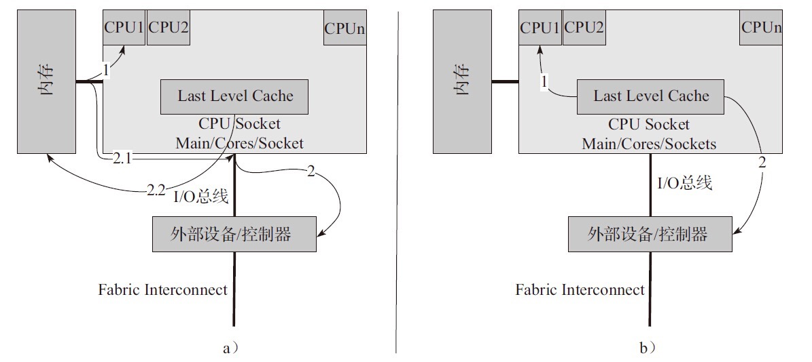
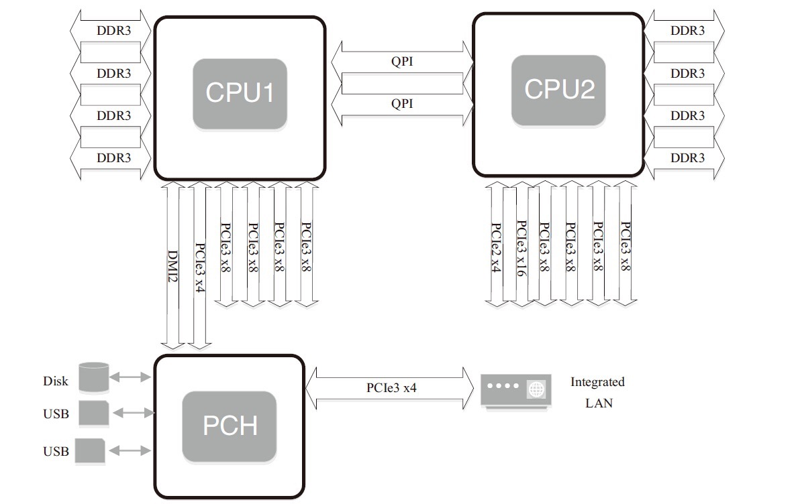
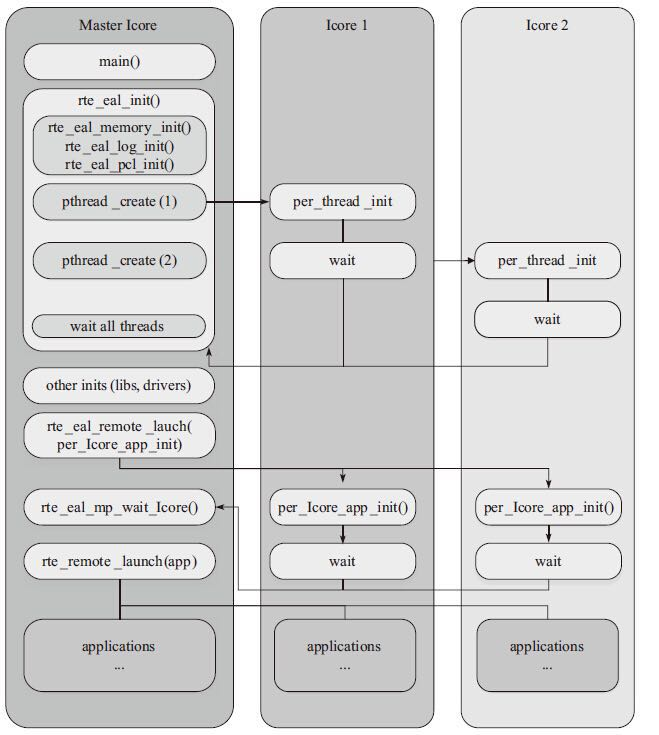

# DPDK简介

## 主流包处理硬件平台

* 硬件加速器：ASIC、FPGA
* 网络处理器
* 多核处理器

## 传统Linux网络驱动的问题

- 中断开销突出，大量数据到来会触发频繁的中断（softirq）开销导致系统无法承受
- 需要把包从内核缓冲区拷贝到用户缓冲区，带来系统调用和数据包复制的开销
- 对于很多网络功能节点来说，TCP/IP协议并非是数据转发环节所必需的
- NAPI/Netmap等虽然减少了内核到用户空间的数据拷贝，但操作系统调度带来的cache替换也会对性能产生负面影响

## dpdk最佳实践

* PMD用户态驱动: DPDK针对Intel网卡实现了基于轮询方式的PMD（Poll Mode Drivers）驱动，该驱动由API、用户空间运行的驱动程序构成，该驱动使用**无中断方式直接操作网卡的接收和发送队列**（除了链路状态通知仍必须采用中断方式以外）。目前PMD驱动支持Intel的大部分1G、10G和40G的网卡。PMD驱动从网卡上接收到数据包后，会直接通过DMA方式传输到预分配的内存中，同时更新无锁环形队列中的数据包指针，不断轮询的应用程序很快就能感知收到数据包，并在预分配的内存地址上直接处理数据包，这个过程非常简洁。*如果要是让Linux来处理收包过程，首先网卡通过中断方式通知协议栈对数据包进行处理，协议栈先会对数据包进行合法性进行必要的校验，然后判断数据包目标是否本机的socket，满足条件则会将数据包拷贝一份向上递交给用户socket来处理，不仅处理路径冗长，还需要从内核到应用层的一次拷贝过程。*
* hugetlbfs: 这样有两个好处：第一是使用hugepage的内存所需的页表项比较少，对于需要大量内存的进程来说节省了很多开销，像oracle之类的大型数据库优化都使用了大页面配置；第二是TLB冲突概率降低，TLB是cpu中单独的一块高速cache，采用hugepage可以大大降低TLB miss的开销。DPDK目前支持了2M和1G两种方式的hugepage。通过修改默认/etc/grub.conf中hugepage配置为“default_hugepagesz=1G hugepagesz=1G hugepages=32 isolcpus=0-22”，然后通过mount –t hugetlbfs nodev /mnt/huge就将hugepage文件系统hugetlbfs挂在/mnt/huge目录下，然后用户进程就可以使用mmap映射hugepage目标文件来使用大页面了。测试表明应用使用大页表比使用4K的页表性能提高10%~15%。
* CPU亲缘性和独占: 多核则是每个CPU核一个线程，核心之间访问数据无需上锁。为了最大限度减少线程调度的资源消耗，需要将Linux绑定在特定的核上，释放其余核心来专供应用程序使用。 同时还需要考虑CPU特性和系统是否支持NUMA架构，如果支持的话，不同插槽上CPU的进程要避免访问远端内存，尽量访问本端内存。
	* 避免不同核之间的频繁切换，从而避免cache miss和cache write back
	* 避免同一个核内多任务切换开销
* 降低内存访问开销: 
	* 借助大页降低TLB miss
	* 利用内存多通道交错访问提高内存访问的有效带宽
	* 利用内存非对称性感知避免额外的访存延迟
	* 少用数组和指针，多用局部变量
	* 少用全局变量
	* 一次多访问一些数据
	* 自己管理内存分配；进程间传递指针而非整个数据块
* Cache有效性得益于空间局部性（附近的数据也会被用到）和时间局部性（今后一段时间内会被多次访问）原理，通过合理的使用cache，能够使得应用程序性能得到大幅提升
* 避免False Sharing: 多核CPU中每个核都拥有自己的L1/L2 cache，当运行多线程程序时，尽管算法上不需要共享变量，但实际执行中两个线程访问同一cache line的数据时就会引起冲突，每个线程在读取自己的数据时也会把别人的cacheline读进来，这时一个核修改改变量，CPU的cache一致性算法会迫使另一个核的cache中包含该变量所在的cache line无效，这就产生了false sharing（伪共享）问题. Falsing sharing会导致大量的cache冲突，应该尽量避免。 访问全局变量和动态分配内存是falsesharing问题产生的根源，当然访问在内存中相邻的但完全不同的全局变量也可能会导致false sharing，多使用线程本地变量是解决false sharing的根源办法。
* 内存对齐：根据不同存储硬件的配置来优化程序，性能也能够得到极大的提升。在硬件层次，确保对象位于不同channel和rank的起始地址，这样能保证对象并并行加载。字节对齐：众所周知，内存最小的存储单元为字节，在32位CPU中，寄存器也是32位的，为了保证访问更加高效，在32位系统中变量存储的起始地址默认是4的倍数（64位系统则是8的倍数），定义一个32位变量时，只需要一次内存访问即可将变量加载到寄存器中，这些工作都是编译器完成的，不需人工干预，当然我们可以使用attribute((aligned(n)))来改变对齐的默认值。
* cache对齐，这也是程序开发中需要关注的。Cache line是CPU从内存加载数据的最小单位，一般L1 cache的cache line大小为64字节。如果CPU访问的变量不在cache中，就需要先从内存调入到cache，调度的最小单位就是cache line。因此，内存访问如果没有按照cache line边界对齐，就会多读写一次内存和cache了。
* NUMA: NUMA系统节点一般是由一组CPU和本地内存组成。NUMA调度器负责将进程在同一节点的CPU间调度，除非负载太高，才迁移到其它节点，但这会导致数据访问延时增大。
* 减少进程上下文切换: 需要了解哪些场景会触发CS操作。首先就介绍的就是不可控的场景：进程时间片到期；更高优先级进程抢占CPU。其次是可控场景：休眠当前进程(pthread_cond_wait)；唤醒其它进程(pthread_cond_signal)；加锁函数、互斥量、信号量、select、sleep等非常多函数都是可控的。对于可控场景是在应用编程需要考虑的问题，只要程序逻辑设计合理就能较少CS的次数。对于不可控场景，首先想到的是适当减少活跃进程或线程数量，因此保证活跃进程数目不超过CPU个数是一个明智的选择；然后有些场景下，我们并不知道有多少个活跃线程的时候怎么来保证上下文切换次数最少呢？这是我们就需要使用线程池模型：让每个线程工作前都持有带计数器的信号量，在信号量达到最大值之前，每个线程被唤醒时仅进行一次上下文切换，当信号量达到最大值时，其它线程都不会再竞争资源了。
* 分组预测机制，如果预测的一个分支指令加入流水线，之后却发现它是错误的分支，处理器要回退该错误预测执行的工作，再用正确的指令填充流水线。这样一个错误的预测会严重浪费时钟周期，导致程序性能下降。《计算机体系结构：量化研究方法》指出分支指令产生的性能影响为10%~30%，流水线越长，性能影响越大。Core i7和Xen等较新的处理器当分支预测失效时无需刷新全部流水，当错误指令加载和计算仍会导致一部分开销。分支预测中最核心的是分支目标缓冲区（Branch Target Buffer，简称BTB），每条分支指令执行后，都会BTB都会记录指令的地址及它的跳转信息。BTB一般比较小，并且采用Hash表的方式存入，在CPU取值时，直接将PC指针和BTB中记录对比来查找，如果找到了，就直接使用预测的跳转地址，如果没有记录，必须通过cache或内存取下一条指令。
* 利用流水线并发: 像Pentium处理器就有U/V两条流水，并且可以独自独立读写缓存，循环2可以将两条指令安排在不同流水线上执行，性能得到极大提升。另外两条流水线是非对称的，简单指令（mpv,add,push,inc,cmp,lea等）可以在两条流水上并行执行、位操作和跳转操作并发的前提是在特定流水线上工作、而某些复杂指令却只能独占CPU。
* 为了利用空间局部性，同时也为了覆盖数据从内存传输到CPU的延迟，可以在数据被用到之前就将其调入缓存，这一技术称为预取Prefetch，加载整个cache即是一种预取。CPU在进行计算过程中可以并行的对数据进行预取操作，因此预取使得数据/指令加载与CPU执行指令可以并行进行。
* 充分挖掘网卡的潜能：借助现代网卡支持的分流（RSS, FDIR）和卸载（TSO，chksum）等特性。

## Cache子系统

* 一级Cache：4个指令周期，分为数据cache和指令cache，一般只有几十KB
* 二级Cache：12个指令周期，几百KB到几MB
* 三级Cache：26-31个指令周期，几MB到几十MB
* TLB Cache：缓存内存中的页表项，减少CPU开销

如何把内存中的内容放到cache中呢？这里需要映射算法和分块机制。当今主流块大小是64字节。

硬件Cache预取（Netburst为例）：

* 只有两次cache miss才能激活预取机制，且2次的内存地址偏差不超过256或512字节
* 一个4KB的page内只定义一条stream
* 能同时独立的追踪8条stream
* 对4KB边界之外不进行预取
* 预取的数据放在二级或三级cache中
* 对strong uncacheable和write combining内存类型不预取

硬件预取不一定能够提升性能，所以DPDK还借助软件预取尽量将数据放到cache中。另外，DPDK在定义数据结构的时候还保证了cache line对齐。

cache一致性

* 原则是避免多个核访问同一个内存地址或数据结构
* 在数据结构上：每个核都有独立的数据结构
* 多个核访问同一个网卡：每个核都创建单独的接收队列和发送队列

## Huge Page

hugetlbfs有两个好处：

* 第一是使用hugepage的内存所需的页表项比较少，对于需要大量内存的进程来说节省了很多开销，像oracle之类的大型数据库优化都使用了大页面配置；
* 第二是TLB冲突概率降低，TLB是cpu中单独的一块高速cache，采用hugepage可以大大降低TLB miss的开销。

DPDK目前支持了2M和1G两种方式的hugepage。通过修改默认/etc/grub.conf中hugepage配置为`default_hugepagesz=1G hugepagesz=1G hugepages=32 isolcpus=0-22`，然后通过`mount –t hugetlbfs nodev /mnt/huge`就将hugepage文件系统hugetlbfs挂在/mnt/huge目录下，然后用户进程就可以使用mmap映射hugepage目标文件来使用大页面了。测试表明应用使用大页表比使用4K的页表性能提高10%-15%。

Linux系统启动后预留大页的方法

* 非NUMA系统： `echo 1024 > /sys/kernel/mm/hugepages/hugepages-2048kB/nr_hugepages `
* NUMA系统：`echo 1024 > /sys/devices/system/node/node0/hugepages/hugepages-2048kB/nr_hugepages `
* 对于1G的大页，必须在系统启动的时候指定，不能动态预留.

## Data Direct I/O (DDIO)

DDIO使得外部网卡和CPU通过LLC cache直接交换数据，绕过了内存，增加了CPU处理报文的速度。

在Intel E5系列产品中，LLC Cache的容量提高到了20MB。



 
## NUMA

NUMA来源于AMD Opteron微架构，处理器和本地内存之间有更小的延迟和更大的带宽；每个处理器还可以有自己的总线。处理器访问本地的总线和内存时延迟低，而访问远程资源时则要高。



DPDK充分利用了NUMA的特点

* Per-core memory，每个核都有自己的内存，一方面是本地内存的需要，另一方面也是为了cache一致性
* 用本地处理器和本地内存处理本地设备上产生的数据

```c
q = rte_zmalloc_socket("fm10k", sizeof(*q), RTE_CACHE_LINE_SIZE, socket_id)
```

CPU核心的几个概念：

- 处理器核数（cpu cores）：每个物理CPUcore的个数
- 逻辑处理器核心数（siblings）：单个物理处理器超线程的个数
- 系统物理处理器封装ID（physical id）：也称为socket插槽，物理机处理器封装个数，物理CPU个数
- 系统逻辑处理器ID（processor）：逻辑CPU数，是物理处理器的超线程技术

**CPU亲和性**

将进程与CPU绑定，提高了Cache命中率，从而减少内存访问损耗。CPU亲和性的主要应用场景为

- 大量计算场景
- 运行时间敏感、决定性的线程，即实时线程

相关工具

- `sched_set_affinity()`、`sched_get_affinity()`内核函数
- taskset命令
- isolcpus内核启动参数：CPU绑定之后依然是有可能发生线程切换，可以借助isolcpus=2,3将cpu从内核调度系统中剥离。

**DPDK中的CPU亲和性**

DPDK中lcore实际上是EAL pthread，每个EAL pthread都有一个Thread Local Storage的`_lcore_id`，`_lcore_id`与CPU ID是一致的。注意虽然默认是1:1关系，但可以通过`--lcores='<lcore_set>@<cpu_set>'`来指定lcore的CPU亲和性，这样可以不是1:1的，也就是多个lcore还是可以亲和到同一个的核，这就需要注意调度的情况（以非抢占式无锁`rte_ring`为例）：

- 单生产者、单消费者模式不受影响
- 多生产者、多消费者模式，调度策略为`SCHED_OTHER`时，性能会有所影响
- 多生产者、多消费者模式，调度策略为`SCHED_FIFO/SCHED_RR`，会产生死锁

而在具体实现流程如下所示：



- DPDK通过读取`/sys/devices/system/cpu/cpuX/`目录的信息获取CPU的分布情况，将第一个核设置为MASTER，并通过`eal_thread_set_affinity()`为每个SLAVE绑定CPU
- 不同模块要调用`rte_eal_mp_remote_launch()`将自己的回调函数注册到DPDK中（`lcore_config[].f`）
- 每个核最终调用`eal_thread_loop()->回调函数`来执行真正的逻辑

**指令并发**

借助SIMD（Single Instruction Multiple Data，单指令多数据）可以最大化的利用一级缓存访存的带宽，但对频繁的窄位宽数据操作就有比较大的副作用。DPDK中的`rte_memcpy()`在Intel处理器上充分利用了SSE/AVX的特点：优先保证Store指令存储的地址对齐，然后在每个指令周期指令2条Load的特新弥补一部分非对齐Load带来的性能损失。


