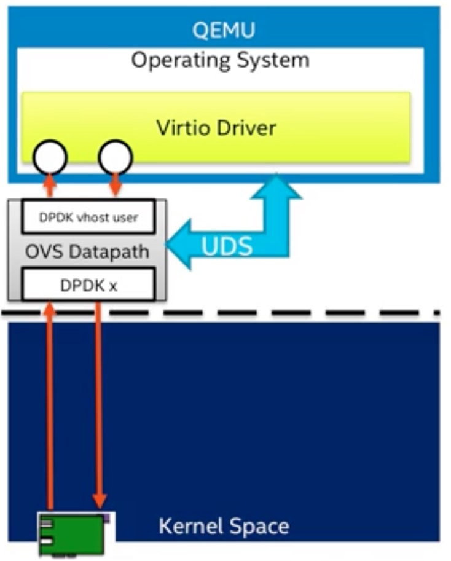
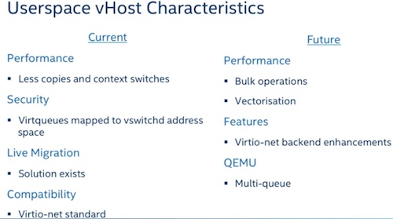
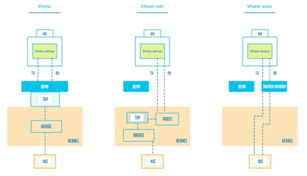

# 网络虚拟化

I/O虚拟化包括管理虚拟设备和共享的物理硬件之间I/O请求的路由选择。目前，实现I/O虚拟化有三种方式：I/O全虚拟化、I/O半虚拟化和I/O透传。

- 全虚拟化：宿主机截获客户机对I/O设备的访问请求，然后通过软件模拟真实的硬件。这种方式对客户机而言非常透明，无需考虑底层硬件的情况，不需要修改操作系统。
- 半虚拟化：通过前端驱动/后端驱动模拟实现I/O虚拟化。客户机中的驱动程序为前端，宿主机提供的与客户机通信的驱动程序为后端。前端驱动将客户机的请求通过与宿主机间的特殊通信机制发送给后端驱动，后端驱动在处理完请求后再发送给物理驱动。
- IO透传：直接把物理设备分配给虚拟机使用，这种方式需要硬件平台具备I/O透传技术，例如Intel VT-d技术。它能获得近乎本地的性能，并且CPU开销不高。

DPDK支持半虚拟化的前端virtio和后端vhost，并且对前后端都有性能加速的设计，这些将分别在后面两章介绍。而对于I/O透传，DPDK可以直接在客户机里使用，就像在宿主机里，直接接管物理设备，进行操作。

## I/O透传

I/O透传带来的好处是高性能，几乎可以获得本机的性能，这个主要是因为Intel®VT-d的技术支持，在执行IO操作时大量减少甚至避免VM-Exit陷入到宿主机中。目前只有PCI和PCI-e设备支持Intel®VT-d技术。可以配合SR-IOV使用，让一个网卡生成多个独立的虚拟网卡，把这些虚拟网卡分配给每一个客户机，可以获得相对好的性能。

**VT-d**

VT-d主要给宿主机软件提供了以下的功能：

- I/O设备的分配：可以灵活地把I/O设备分配给虚拟机，把对虚拟机的保护和隔离的特性扩展到IO的操作上来。
- DMA重映射：可以支持来自设备DMA的地址翻译转换。
- 中断重映射：可以支持来自设备或者外部中断控制器的中断的隔离和路由到对应的虚拟机。
- 可靠性：记录并报告DMA和中断的错误给系统软件，否则的话可能会破坏内存或影响虚拟机的隔离。

**SR-IOV**

SR-IOV技术是由PCI-SIG制定的一套硬件虚拟化规范，全称是Single Root IO Virtualization（单根IO虚拟化）。SR-IOV规范主要用于网卡（NIC）、磁盘阵列控制器（RAID controller）和光纤通道主机总线适配器（Fibre Channel Host Bus Adapter，FC HBA），使数据中心达到更高的效率。SR-IOV架构中，一个I/O设备支持最多256个虚拟功能，同时将每个功能的硬件成本降至最低。SR-IOV引入了两个功能类型：

- PF（Physical Function，物理功能）：这是支持SR-IOV扩展功能的PCIe功能，主要用于配置和管理SR-IOV，拥有所有的PCIe设备资源。PF在系统中不能被动态地创建和销毁（PCI Hotplug除外）。
- VF（Virtual Function，虚拟功能）：“精简”的PCIe功能，包括数据迁移必需的资源，以及经过谨慎精简的配置资源集，可以通过PF创建和销毁。

## virtio

在客户机操作系统中实现的前端驱动程序一般直接叫Virtio，在宿主机实现的后端驱动程序目前常用的叫vhost。与宿主机纯软件模拟I/O（如e1000、rtl8139）设备相比，virtio可以获得很好的I/O性能。但其缺点是必须要客户机安装特定的virtio驱动使其知道是运行在虚拟化环境中。

常见的virtio设备

**Virtio网络设备Linux内核驱动设计**

Virtio网络设备Linux内核驱动主要包括三个层次：底层PCI-e设备层，中间Virtio虚拟队列层，上层网络设备层。

**DPDK用户空间virtio设备的优化**

DPDK用户空间驱动和Linux内核驱动相比，主要不同点在于DPDK只暂时实现了Virtio网卡设备，所以整个构架和优化上面可以暂时只考虑网卡设备的应用场景。

* 关于单帧mbuf的网络包收发优化：固定了可用环表表项与描述符表项的映射，即可用环表所有表项head_idx指向固定的vring描述符表位置（对于接收过程，可用环表0->描述符表0，1->1，…，255->255的固定映射；对于发送过程，0->128，1->129，…127->255，128->128，129->129，…255->255的固定映射，描述符表0~127指向mbuf的数据区域，描述符表128~255指向virtio net header的空间），对可用环表的更新只需要更新环表自身的指针。固定的可用环表除了能够避免不同核之间的CACHE迁移，也节省了vring描述符的分配和释放操作，并为使用SIMD指令进行进一步加速提供了便利。
* Indirect特性在网络包发送中的支持：如前面介绍，发送的包至少需要两个描述符。通过支持indirect特性，任何一个要发送的包，无论单帧还是巨型帧（巨型帧的介绍见6.6.1节）都只需要一个描述符，该描述符指向一块驱动程序额外分配的间接描述符表的内存区域。

## vhost

virtio-net的后端驱动经历过从virtio-net后端，到内核态vhost-net，再到用户态vhost-user的演进过程。

### virtio-net

virtio-net后端驱动的最基本要素是虚拟队列机制、消息通知机制和中断机制。虚拟队列机制连接着客户机和宿主机的数据交互。消息通知机制主要用于从客户机到宿主机的消息通知。中断机制主要用于从宿主机到客户机的中断请求和处理。

性能瓶颈主要存在于数据通道和消息通知路径这两块：

- 1）数据通道是从Tap设备到Qemu的报文拷贝和Qemu到客户机的报文拷贝，两次报文拷贝导致报文接收和发送上的性能瓶颈。
- 2）消息通知路径是当报文到达Tap设备时内核发出并送到Qemu的通知消息，然后Qemu利用IOCTL向KVM请求中断，KVM发送中断到客户机。

### Linux内核态vhost-net

vhost-net通过卸载virtio-net在报文收发处理上的工作，使Qemu从virtio-net的虚拟队列工作中解放出来，减少上下文切换和数据包拷贝，进而提高报文收发的性能。除此以外，宿主机上的vhost-net模块还需要承担报文到达和发送消息通知及中断的工作。

报文接收仍然包括数据通路和消息通知路径两个方面：

- 1）数据通路是从Tap设备接收数据报文，通过vhost-net模块把该报文拷贝到虚拟队列中的数据区，从而使客户机接收报文。
- 2）消息通路是当报文从Tap设备到达vhost-net时，通过KVM模块向客户机发送中断，通知客户机接收报文。

### 用户态vhost

Linux内核态的vhost-net模块需要在内核态完成报文拷贝和消息处理，这会给报文处理带来一定的性能损失，因此用户态的vhost应运而生。用户态vhost采用了共享内存技术，通过共享的虚拟队列来完成报文传输和控制，大大降低了vhost和virtio-net之间的数据传输成本。

- 1) 数据通路不再涉及内核，直接通过共享内存发送给用户态应用（如DPDK，OVS）
- 2) 消息通路通过Unix Domain Socket实现

DPDK vhost同时支持Linux virtio-net驱动和DPDK virtio PMD驱动的前端。

## DPDK vhost

DPDK vhost支持vhost-cuse（用户态字符设备）和vhost-user（用户态socket服务）两种消息机制，它负责为客户机中的virtio-net创建、管理和销毁vhost设备。

当使用vhost-user时，首先需要在系统中创建一个Unix domain socket server，用于处理Qemu发送给vhost的消息，其消息机制如图所示。

DPDK的vhost有两种封装形式：vhost lib和vhost PMD。vhost lib实现了用户态的vhost驱动供vhost应用程序调用，而vhost PMD则对vhost lib进行了封装，将其抽象成一个虚拟端口，可以使用标准端口的接口来进行管理和报文收发。

DPDK示例程序vhost-switch是基于vhost lib的一个用户态以太网交换机的实现，可以完成在virtio-net设备和物理网卡之间的报文交换。还使用了虚拟设备队列（VMDQ）技术来减少交换过程中的软件开销，该技术在网卡上实现了报文处理分类的任务，大大减轻了处理器的负担。

## 对比

