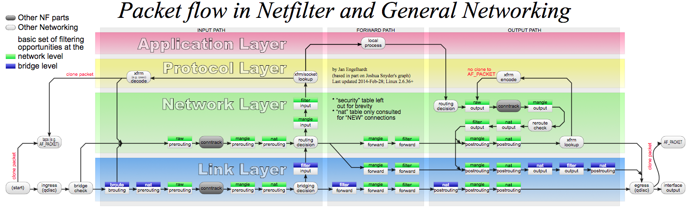
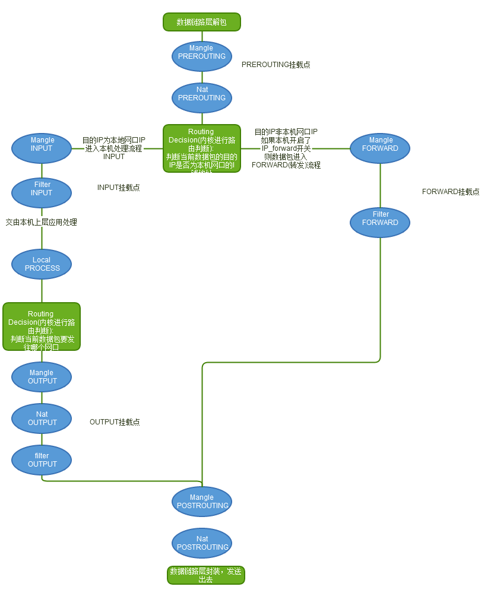

# iptables/netfilter

iptables是一个配置Linux内核防火墙的命令行工具，它基于内核的netfilter机制。新版本的内核（3.13+）也提供了nftables，用于取代iptables。

## netfilter

netfilter是Linux内核的包过滤框架，它提供了一系列的钩子（Hook）供其他模块控制包的流动。这些钩子包括

- `NF_IP_PRE_ROUTING`：刚刚通过数据链路层解包进入网络层的数据包通过此钩子，它在路由之前处理
- `NF_IP_LOCAL_IN`：经过路由查找后，送往本机（目的地址在本地）的包会通过此钩子
- `NF_IP_FORWARD`：不是本地产生的并且目的地不是本地的包（即转发的包）会通过此钩子
- `NF_IP_LOCAL_OUT`：所有本地生成的发往其他机器的包会通过该钩子
- `NF_IP_POST_ROUTING`：在包就要离开本机之前会通过该钩子，它在路由之后处理



## iptables

iptables通过表和链来组织数据包的过滤规则，每条规则都包括匹配和动作两部分。默认情况下，每张表包括一些默认链，用户也可以添加自定义的链，这些链都是顺序排列的。这些表和链包括：

- raw表用于决定数据包是否被状态跟踪机制处理，内建PREROUTING和OUTPUT两个链
- filter表用于过滤，内建INPUT（目的地是本地的包）、FORWARD（不是本地产生的并且目的地不是本地）和OUTPUT（本地生成的包）等三个链
- nat用表于网络地址转换，内建PREROUTING（在包刚刚到达防火墙时改变它的目的地址）、INPUT、OUTPUT和POSTROUTING（要离开防火墙之前改变其源地址）等链
- mangle用于对报文进行修改，内建PREROUTING、INPUT、FORWARD、OUTPUT和POSTROUTING等链
- security表用于根据安全策略处理数据包，内建INPUT、FORWARD和OUTPUT链

Tables↓/Chains→               | PREROUTING | INPUT | FORWARD | OUTPUT | POSTROUTING
----------------------------- |:----------:|:-----:|:-------:|:------:|:-----------:
(routing decision)            |            |       |         |   ✓    |            
**raw**                       |     ✓      |       |         |   ✓    |            
(connection tracking enabled) |     ✓      |       |         |   ✓    |            
**mangle**                    |     ✓      |   ✓   |    ✓    |   ✓    |      ✓     
**nat** (DNAT)                |     ✓      |       |         |   ✓    |            
(routing decision)            |     ✓      |       |         |   ✓    |            
**filter**                    |            |   ✓   |    ✓    |   ✓    |            
**security**                  |            |   ✓   |    ✓    |   ✓    |            
**nat** (SNAT)                |            |   ✓   |         |        |      ✓     

所有链默认都是没有任何规则的，用户可以按需要添加规则。每条规则都包括匹配和动作两部分：

- 匹配可以有多条，比如匹配端口、IP、数据包类型等。匹配还可以包括模块（如conntrack、recent等），实现更复杂的过滤。
- 动作只能有一个，通过`-j`指定，如ACCEPT、DROP、RETURN、SNAT、DNAT等

这样，网络数据包通过iptables的过程为



其规律为

1. 当一个数据包进入网卡时，数据包首先进入PREROUTING链，在PREROUTING链中我们有机会修改数据包的DestIP(目的IP)，然后内核的"路由模块"根据"数据包目的IP"以及"内核中的路由表"
判断是否需要转送出去(注意，这个时候数据包的DestIP有可能已经被我们修改过了)
2. 如果数据包就是进入本机的(即数据包的目的IP是本机的网口IP)，数据包就会沿着图向下移动，到达INPUT链。数据包到达INPUT链后，任何进程都会收到它
3. 本机上运行的程序也可以发送数据包，这些数据包经过OUTPUT链，然后到达POSTROTING链输出(注意，这个时候数据包的SrcIP有可能已经被我们修改过了)
4. 如果数据包是要转发出去的(即目的IP地址不再当前子网中)，且内核允许转发，数据包就会向右移动，经过FORWARD链，然后到达POSTROUTING链输出(选择对应子网的网口发送出去)

### iptables示例

查看规则列表

```sh
iptables -nvL
```

允许22端口

```sh
iptables -A INPUT -p tcp --dport 22 -j ACCEPT
```

允许来自192.168.0.4的包

```sh
iptables -A INPUT -s 192.168.0.4 -j ACCEPT
```

允许现有连接或与现有连接关联的包

```sh
iptables -A INPUT -m state --state ESTABLISHED,RELATED -j ACCEPT
```

禁止ping包

```sh
iptables -A INPUT -p icmp --icmp-type echo-request -j DROP
```

禁止所有其他包

```sh
iptables -P INPUT DROP
iptables -P FORWARD DROP
```

MASQUERADE

```sh
iptables -t nat -I POSTROUTING -s 10.0.0.30/32 -j MASQUERADE
```

NAT

```sh
iptables -I FORWARD -m state --state RELATED,ESTABLISHED -j ACCEPT
iptables -I INPUT   -m state --state RELATED,ESTABLISHED -j ACCEPT
iptables -t nat -I OUTPUT -d 55.55.55.55/32 -j DNAT --to-destination 10.0.0.30
iptables -t nat -I PREROUTING -d 55.55.55.55/32 -j DNAT --to-destination 10.0.0.30
iptables -t nat -I POSTROUTING -s 10.0.0.30/32 -j SNAT --to-source 55.55.55.55
```

端口映射

```sh
iptables -t nat -I OUTPUT -d 55.55.55.55/32 -p tcp -m tcp --dport 80 -j DNAT --to-destination 10.10.10.3:80
iptables -t nat -I POSTROUTING -m conntrack ! --ctstate DNAT -j ACCEPT
iptables -t nat -I PREROUTING -d 55.55.55.55/32 -p tcp -m tcp --dport 80 -j DNAT --to-destination 10.10.10.3:80
```

重置所有规则

```sh
iptables -F
iptables -t nat -F
iptables -t mangle -F
iptables -X
```

## nftables

nftables 是从内核 3.13 版本引入的新的数据包过滤框架，旨在替代现用的 iptables 框架。nftables引入了一个新的命令行工具`nft`，取代了之前的iptables、ip6iptables、ebtables等各种工具。

跟iptables相比，nftables带来了一系列的好处

- 更易用易理解的语法
- 表和链是完全可配置的
- 匹配和目标之间不再有区别
- 在一个规则中可以定义多个动作
- 每个链和规则都没有内建的计数器
- 更好的动态规则集更新支持
- 简化IPv4/IPv6双栈管理
- 支持set/map等
- 支持级连（需要内核4.1+）

跟iptables类似，nftables也是使用表和链来管理规则。其中，表包括ip、arp、ip6、bridge、inet和netdev等6个类型。下面是一些简单的例子。

```sh
# 新建一个ip类型的表
nft add table ip foo

# 列出所有表
nft list tables

# 删除表
nft delete table ip foo

# 添加链
nft add table ip filter
nft add chain ip filter input { type filter hook input priority 0 \; }
nft add chain ip filter output { type filter hook output priority 0 \; }

# 添加规则
nft add rule filter output ip daddr 8.8.8.8 counter
nft add rule filter output tcp dport ssh counter
nft insert rule filter output ip daddr 192.168.1.1 counter

# 列出规则
nft list table filter

# 删除规则
nft list table filter -a # 查询handle是多少
nft delete rule filter output handle 5

# 删除链中所有规则
nft delete rule filter output

# 删除表中所有规则
nft flush table filter
```

## 参考文档

- [A Deep Dive into Iptables and Netfilter Architecture](https://www.digitalocean.com/community/tutorials/a-deep-dive-into-iptables-and-netfilter-architecture)
- <http://www.netfilter.org/>
- [iptables wiki](https://wiki.archlinux.org/index.php/Iptables)
- [nftables wiki](https://wiki.nftables.org/wiki-nftables/index.php/Main_Page)
- [Linux数据包路由原理、Iptables/netfilter入门学习](http://www.cnblogs.com/LittleHann/p/3708222.html)