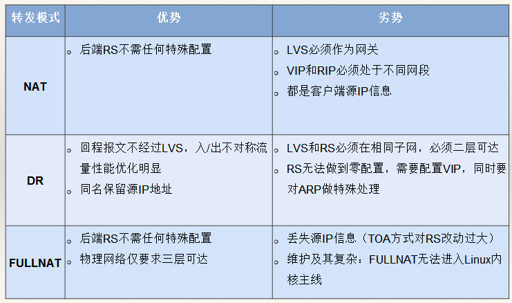

# 负载均衡

## lvs

Linux Virtual Server (lvs) 是Linux内核自带的负载均衡器，也是目前性能最好的软件负载均衡器之一。

### 转发模式



### 调度算法

- 轮叫调度（Round-Robin Scheduling）
- 加权轮叫调度（Weighted Round-Robin Scheduling）
- 最小连接调度（Least-Connection Scheduling）
- 加权最小连接调度（Weighted Least-Connection Scheduling）
- 基于局部性的最少链接（Locality-Based Least Connections Scheduling）
- 带复制的基于局部性最少链接（Locality-Based Least Connections with Replication Scheduling）
- 目标地址散列调度（Destination Hashing Scheduling）
- 源地址散列调度（Source Hashing Scheduling）
- 最短预期延时调度（Shortest Expected Delay Scheduling）
- 不排队调度（Never Queue Scheduling）

### lvs配置示例

安装ipvs包并开启ip转发

```sh
yum -y install ipvsadm keepalived
sysctl -w net.ipv4.ip_forward=1
```

修改/etc/keepalived/keepalived.conf，增加vip和lvs的配置

```
vrrp_instance VI_3 {
    state MASTER   # 另一节点为BACKUP
    interface eth0
    virtual_router_id 11
    priority 100   # 另一节点为50
    advert_int 1
    authentication {
        auth_type PASS
        auth_pass PASSWORD
    }

    track_script {
        chk_http_port
    }

    virtual_ipaddress {
        192.168.0.100
    }
}

virtual_server 192.168.0.100 9696 {
    delay_loop 30
    lb_algo rr
    lb_kind DR
    persistence_timeout 30
    protocol TCP

    real_server 192.168.0.101 9696 {
        weight 3
        TCP_CHECK {
            connect_timeout 10
            nb_get_retry 3
            delay_before_retry 3
            connect_port 9696
        }
    }

    real_server 192.168.0.102 9696 {
        weight 3
        TCP_CHECK {
            connect_timeout 10
            nb_get_retry 3
            delay_before_retry 3
            connect_port 9696
        }
    }
}
```

重启keepalived：

    systemctl reload keepalived

最后在neutron-server所在机器上为lo配置vip，并抑制ARP响应：

```sh
vip=192.168.0.100
ifconfig lo:1 ${vip} broadcast ${vip} netmask 255.255.255.255
route add -host ${vip} dev lo:1
echo "1" >/proc/sys/net/ipv4/conf/lo/arp_ignore
echo "2" >/proc/sys/net/ipv4/conf/lo/arp_announce
echo "1" >/proc/sys/net/ipv4/conf/all/arp_ignore
echo "2" >/proc/sys/net/ipv4/conf/all/arp_announce
```

### LVS缺点

- Keepalived主备模式设备利用率低；不能横向扩展；VRRP协议，有脑裂的风险。
- ECMP的方式需要了解动态路由协议，LVS和交换机均需要较复杂配置；交换机的HASH算法一般比较简单，增加删除节点会造成HASH重分布，可能导致当前TCP连接全部中断；部分交换机的ECMP在处理分片包时会有BUG。

## Haproxy

Haproxy也是Linux最常用的负载均衡软件之一，兼具性能和功能的组合，同时支持TCP和HTTP负载均衡。

配置和使用方法请见[官网](http://www.haproxy.org/)。

## Nginx

Nginx也是Linux最常用的负载均衡软件之一，常用作反向代理和HTTP负载均衡（当然也支持TCP和UDP负载均衡）。

配置和使用方法请见[官网](https://nginx.org/en/)。

## 自研负载均衡

### Google Maglev

[Maglev](https://research.google.com/pubs/pub44824.html)是Google自研的负载均衡方案，在2008年就已经开始用于生产环境。Maglev安装后不需要预热5秒内就能处理每秒100万次请求。谷歌的性能基准测试中，Maglev实例运行在一个8核CPU下，网络吞吐率上限为12M PPS（数据包每秒）。如果Maglev使用Linux内核网络堆栈则速度会慢下来，吞吐率小于4M PPS。


- 路由器ECMP (Equal Cost Multipath) 转发包到Maglev（而不是传统的主从结构)
- Kernel Bypass, CPU绑定，共享内存
- 一致性哈希保证连接不中断

### UCloud Vortex

Vortex参考了Maglev，大致的架构和实现跟Maglev类似：

- ECMP实现集群的负载均衡
- 一致性哈希保证连接不中断
    - 即使是不同的Vortex服务器收到了数据包，仍然能够将该数据包转发到同一台后端服务器
    - 后端服务器变化时，通过连接追踪机制保证当前活动连接的数据包被送往之前选择的服务器，而所有新建连接则会在变化后的服务器集群中进行负载分担
- DPDK提升单机性能 (14M PPS，10G, 64字节线速)
    - 通过RSS直接将网卡队列和CPU Core绑定，消除线程的上下文切换带来的开销
    - Vortex线程间采用高并发无锁的消息队列通信
- DR模式避免额外开销

## 参考文档

- <http://www.linuxvirtualserver.org/>
- <http://www.haproxy.org/>
- [揭秘100G＋线速云负载均衡的设计与实现：从Maglev到Vortex](https://mp.weixin.qq.com/s?src=3&timestamp=1495372816&ver=1&signature=ifj0PRCsXKHVPiVcl-dNxhSlKKKcX6hwO1rz-hbipIrL2weMxHv0bSysMyY-yB-AXJrUZix9kjQCpvsRJnxF1grXi*O6nZZjaUFFEdA6ROfgicdAvfEFDM4-i42kY*58X1UmOW8WUoQqc6b8iEuUVw==)