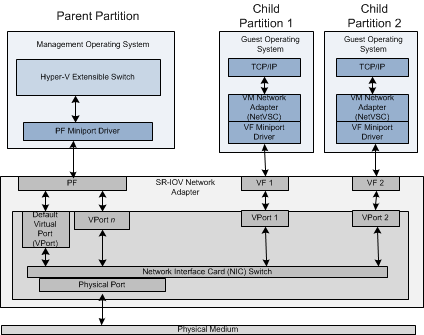
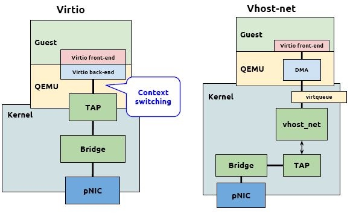
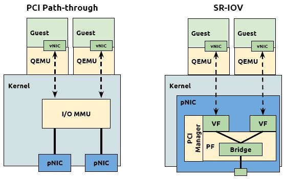
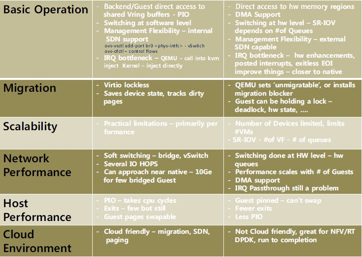
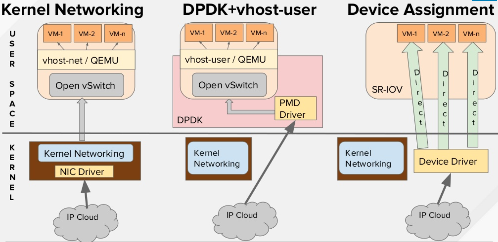
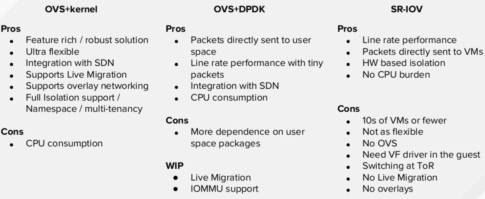
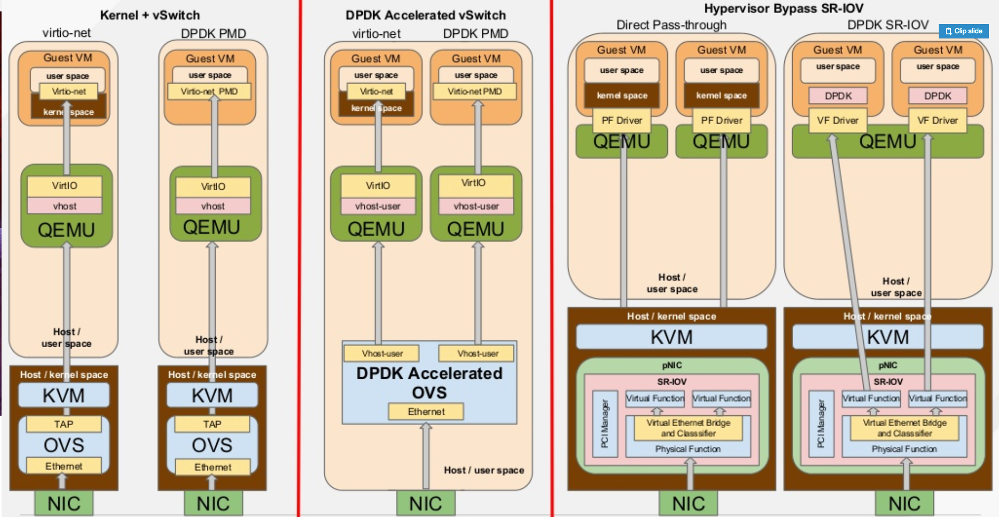

# SR-IOV

SR-IOV（Single Root I/O Virtualization）是一个将PCIe共享给虚拟机的标准，通过为虚拟机提供独立的内存空间、中断、DMA流，来绕过VMM实现数据访问。SR-IOV基于两种PCIe functions：

- PF (Physical Function)： 包含完整的PCIe功能，包括SR-IOV的扩张能力，该功能用于SR-IOV的配置和管理。
- FV (Virtual Function)： 包含轻量级的PCIe功能。每一个VF有它自己独享的PCI配置区域，并且可能与其他VF共享着同一个物理资源



## SR-IOV要求

- CPU 必须支持IOMMU（比如英特尔的 VT-d 或者AMD的 AMD-Vi，Power8 处理器默认支持IOMMU）
- 固件Firmware 必须支持IOMMU
- CPU 根桥必须支持 ACS 或者ACS等价特性
- PCIe 设备必须支持ACS 或者ACS等价特性
- 建议根桥和PCIe 设备中间的所有PCIe 交换设备都支持ACS，如果某个PCIe交换设备不支持ACS，其后的所有PCIe设备只能共享某个IOMMU 组，所以只能分配给1台虚机。

## SR-IOV vs PCI path-through








## SR-IOV vs DPDK







## SR-IOV使用示例

开启VF：

```sh
modprobe -r igb
modprobe igb max_vfs=7
echo "options igb max_vfs=7" >>/etc/modprobe.d/igb.conf
```

查找Virtual Function： 

```sh
# lspci | grep 82576
0b:00.0 Ethernet controller: Intel Corporation 82576 Gigabit Network Connection (rev 01)
0b:00.1 Ethernet controller: Intel Corporation 82576 Gigabit Network Connection(rev 01)
0b:10.0 Ethernet controller: Intel Corporation 82576 Virtual Function (rev 01)
0b:10.1 Ethernet controller: Intel Corporation 82576 Virtual Function (rev 01)
0b:10.2 Ethernet controller: Intel Corporation 82576 Virtual Function (rev 01)
0b:10.3 Ethernet controller: Intel Corporation 82576 Virtual Function (rev 01)
0b:10.4 Ethernet controller: Intel Corporation 82576 Virtual Function (rev 01)
0b:10.5 Ethernet controller: Intel Corporation 82576 Virtual Function (rev 01)
0b:10.6 Ethernet controller: Intel Corporation 82576 Virtual Function (rev 01)
0b:10.7 Ethernet controller: Intel Corporation 82576 Virtual Function (rev 01)
0b:11.0 Ethernet controller: Intel Corporation 82576 Virtual Function (rev 01)
0b:11.1 Ethernet controller: Intel Corporation 82576 Virtual Function (rev 01)
0b:11.2 Ethernet controller: Intel Corporation 82576 Virtual Function (rev 01)
0b:11.3 Ethernet controller: Intel Corporation 82576 Virtual Function (rev 01)
0b:11.4 Ethernet controller: Intel Corporation 82576 Virtual Function (rev 01)
0b:11.5 Ethernet controller: Intel Corporation 82576 Virtual Function (rev 01)

# virsh nodedev-list | grep 0b
pci_0000_0b_00_0
pci_0000_0b_00_1
pci_0000_0b_10_0
pci_0000_0b_10_1
pci_0000_0b_10_2
pci_0000_0b_10_3
pci_0000_0b_10_4
pci_0000_0b_10_5
pci_0000_0b_10_6
pci_0000_0b_11_7
pci_0000_0b_11_1
pci_0000_0b_11_2
pci_0000_0b_11_3
pci_0000_0b_11_4
pci_0000_0b_11_5
```

```sh
$ virsh nodedev-dumpxml pci_0000_0b_00_0
<device>
   <name>pci_0000_0b_00_0</name>
   <parent>pci_0000_00_01_0</parent>
   <driver>
      <name>igb</name>
   </driver>
   <capability type='pci'>
      <domain>0</domain>
      <bus>11</bus>
      <slot>0</slot>
      <function>0</function>
      <product id='0x10c9'>82576 Gigabit Network Connection</product>
      <vendor id='0x8086'>Intel Corporation</vendor>
   </capability>
</device>
```

**通过libvirt绑定到虚拟机**

```sh
$ cat >/tmp/interface.xml <<EOF
<interface type='hostdev' managed='yes'>
     <source>
       <address type='pci' domain='0' bus='11' slot='16' function='0'/>
     </source>
</interface>
EOF
$ virsh attach-device MyGuest /tmp/interface. xml --live --config
```

当然也可以给网卡配置MAC地址和VLAN：

```xml
<interface type='hostdev' managed='yes'>
     <source>
       <address type='pci' domain='0' bus='11' slot='16' function='0'/>
     </source>
     <mac address='52:54:00:6d:90:02'>
     <vlan>
        <tag id='42'/>
     </vlan>
     <virtualport type='802.1Qbh'>
       <parameters profileid='finance'/>
     </virtualport>
   </interface>
```

**通过Qemu绑定到虚拟机**

```
/usr/bin/qemu-kvm -name vdisk -enable-kvm -m 512 -smp 2 \
-hda /mnt/nfs/vdisk.img \
-monitor stdio \
-vnc 0.0.0.0:0 \
-device pci-assign,host=0b:00.0
```

## 优缺点

Pros:

- More Scalable than Direct Assign
- Security through IOMMU and function isolation
- Control Plane separation through PF/VF notion
- High packet rate, Low CPU, Low latency thanks to Direct Pass through

Cons:

- Rigid: Composability issues
- Control plane is pass through, puts pressure on Hardware resources
- Parts of the PCIe config space are direct map from Hardware
- Limited scalability (16 bit)
- SR-IOV NIC forces switching features into the HW
- All the Switching Features in the Hardware or nothing

## 参考文档

- [Intel SR-IOV Configuration Guide](http://www.intel.com/content/www/us/en/embedded/products/networking/xl710-sr-iov-config-guide-gbe-linux-brief.html)
- [OpenStack SR-IOV Passthrough for Networking](https://wiki.openstack.org/wiki/SR-IOV-Passthrough-For-Networking)
- [Redhat OpenStack SR-IOV Configure](https://access.redhat.com/documentation/zh-CN/Red_Hat_Enterprise_Linux_OpenStack_Platform/7/html/Networking_Guide/sec-sr-iov.html)
- [SDN Fundamentails for NFV, Openstack and Containers](http://www.slideshare.net/nyechiel/sdn-fundamentals-for-nfv-open-stack-and-containers-red-hat-summit-20161)
- [I/O设备直接分配和SRIOV](http://www.cnblogs.com/sammyliu/p/4548194.html)
- [Libvirt PCI passthrough of host network devices](http://wiki.libvirt.org/page/Networking#PCI_Passthrough_of_host_network_devices)
- [Story of Network Virtualization and its future in Software and Hardware](http://netdevconf.org/2.1/session.html?jain)

