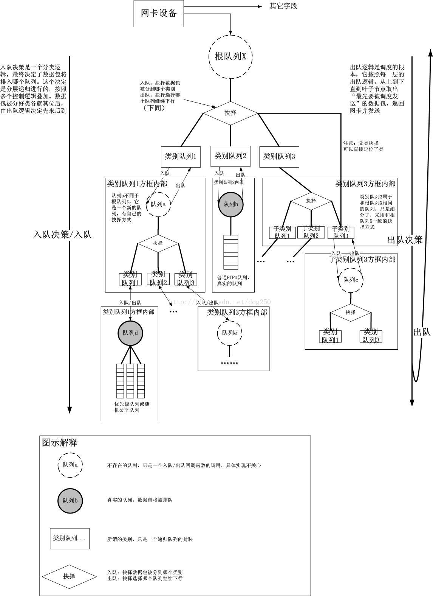
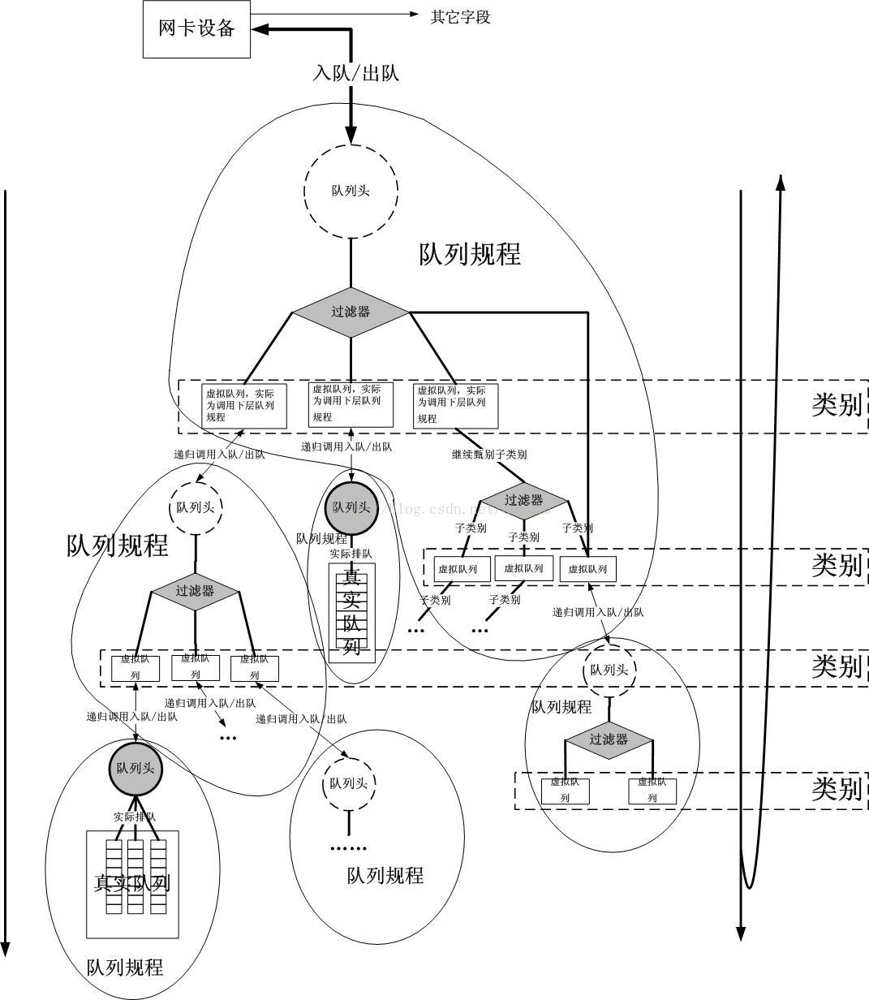
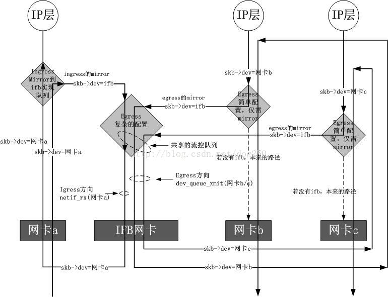
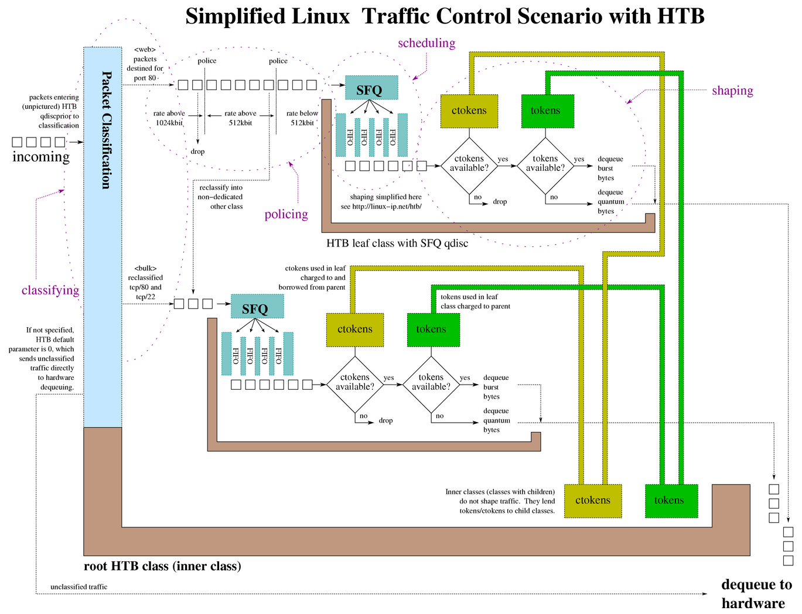

# 流量控制

流量控制（Traffic Control， tc）是Linux内核提供的流量限速、整形和策略控制机制。它以`qdisc-class-filter`的树形结构来实现对流量的分层控制 ：





tc最佳的参考就是[Linux Traffic Control HOWTO](http://www.tldp.org/HOWTO/Traffic-Control-HOWTO/)，详细介绍了tc的原理和使用方法。

## 基本组成

从上图中可以看到，tc由qdisc、fitler和class三部分组成：

- qdisc通过队列将数据包缓存起来，用来控制网络收发的速度
- class用来表示控制策略
- filter用来将数据包划分到具体的控制策略中

### qdisc

qdisc通过队列将数据包缓存起来，用来控制网络收发的速度。实际上，每个网卡都有一个关联的qdisc。它包括以下几种：

- [无分类qdisc（只能应用于root队列）](http://tldp.org/HOWTO/Traffic-Control-HOWTO/classless-qdiscs.html)
  - `[p|b]fifo`：简单先进先出
  - `pfifo_fast`：根据数据包的tos将队列划分到3个band，每个band内部先进先出
  - `red`：Random Early Detection，带带宽接近限制时随机丢包，适合高带宽应用
  - `sfq`：Stochastic Fairness Queueing，按照会话对流量排序并循环发送每个会话的数据包
  - `tbf`：Token Bucket Filter，只允许以不超过事先设定的速率到来的数据包通过 , 但可能允许短暂突发流量朝过设定值
- [有分类qdisc（可以包括多个队列）](http://tldp.org/HOWTO/Traffic-Control-HOWTO/classful-qdiscs.html)
  - `cbq`：Class Based Queueing，借助EWMA(exponential weighted moving average, 指数加权移动均值 ) 算法确认链路的闲置时间足够长 , 以达到降低链路实际带宽的目的。如果发生越限 ,CBQ 就会禁止发包一段时间。
  - `htb`：Hierarchy Token Bucket，在tbf的基础上增加了分层
  - `prio`：分类优先算法并不进行整形 , 它仅仅根据你配置的过滤器把流量进一步细分。缺省会自动创建三个FIFO类。

注意，**一般说到qdisc都是指egress qdisc**。每块网卡实际上还可以添加一个ingress qdisc，不过它有诸多的限制

- ingress qdisc不能包含子类，而只能作过滤
- ingress qdisc只能用于简单的整形

如果相对ingress方向作流量控制的话，可以借助[ifb（ Intermediate Functional Block）](https://wiki.linuxfoundation.org/networking/ifb)内核模块。因为流入网络接口的流量是无法直接控制的，那么就需要把流入的包导入（通过 tc action）到一个中间的队列，该队列在 ifb 设备上，然后让这些包重走 tc 层，最后流入的包再重新入栈，流出的包重新出栈。



### filter

filter用来将数据包划分到具体的控制策略中，包括以下几种：

- u32：根据协议、IP、端口等过滤数据包
- fwmark：根据iptables MARK来过滤数据包
- tos：根据tos字段过滤数据包

### class

class用来表示控制策略，只用于有分类的qdisc上。每个class要么包含多个子类，要么只包含一个子qdisc。当然，每个class还包括一些列的filter，控制数据包流向不同的子类，或者是直接丢掉。

## htb示例



```sh
# add qdisc
tc qdisc add dev eth0 root handle 1: htb default 2 r2q 100
# add default class
tc class add dev eth0 parent 1:0 classid 1:1 htb rate 1000mbit ceil 1000mbit
tc class add dev eth0 parent 1:1 classid 1:2 htb prio 5 rate 1000mbit ceil 1000mbit
tc qdisc add dev eth0 parent 1:2 handle 2: pfifo limit 500
# add default filter
tc filter add dev eth0 parent 1:0 prio 5 protocol ip u32
tc filter add dev eth0 parent 1:0 prio 5 handle 3: protocol ip u32 divisor 256
tc filter add dev eth0 parent 1:0 prio 5 protocol ip u32 ht 800:: match ip src 192.168.0.0/16 hashkey mask 0x000000ff at 12 link 3:

# add egress rules for 192.168.0.9
tc class add dev eth0 parent 1:1 classid 1:9 htb prio 5 rate 3mbit ceil 3mbit
tc qdisc add dev eth0 parent 1:9 handle 9: pfifo limit 500
tc filter add dev eth0 parent 1: protocol ip prio 5 u32 ht 3:9: match ip src "192.168.0.9" flowid 1:9
```

## ifb示例

```sh
# init ifb
modprobe ifb numifbs=1
ip link set ifb0 up
#  redirect ingress to ifb0
tc qdisc add dev eth0 ingress handle ffff:
tc filter add dev eth0 parent ffff: protocol ip prio 0 u32 match u32 0 0 flowid ffff: action mirred egress redirect dev ifb0
# add qdisc
tc qdisc add dev ifb0 root handle 1: htb default 2 r2q 100
# add default class
tc class add dev ifb0 parent 1:0 classid 1:1 htb rate 1000mbit ceil 1000mbit
tc class add dev ifb0 parent 1:1 classid 1:2 htb prio 5 rate 1000mbit ceil 1000mbit
tc qdisc add dev ifb0 parent 1:2 handle 2: pfifo limit 500
# add default filter
tc filter add dev ifb0 parent 1:0 prio 5 protocol ip u32
tc filter add dev ifb0 parent 1:0 prio 5 handle 4: protocol ip u32 divisor 256
tc filter add dev ifb0 parent 1:0 prio 5 protocol ip u32 ht 800:: match ip dst 192.168.0.0/16 hashkey mask 0x000000ff at 16 link 4:

# add ingress rules for 192.168.0.9
tc class add dev ifb0 parent 1:1 classid 1:9 htb prio 5 rate 3mbit ceil 3mbit
tc qdisc add dev ifb0 parent 1:9 handle 9: pfifo limit 500
tc filter add dev ifb0 parent 1: protocol ip prio 5 u32 ht 4:9: match ip dst "192.168.0.9" flowid 1:9
```

## 参考文档

- [Linux Traffic Control HOWTO](http://www.tldp.org/HOWTO/Traffic-Control-HOWTO/)
- [ifb wiki](https://wiki.linuxfoundation.org/networking/ifb)
- [Linux TC (Traffic Control) 框架原理解析](http://blog.csdn.net/dog250/article/details/40483627)
- [Linux TC的ifb原理以及ingress流控](http://blog.csdn.net/dog250/article/details/40680765)