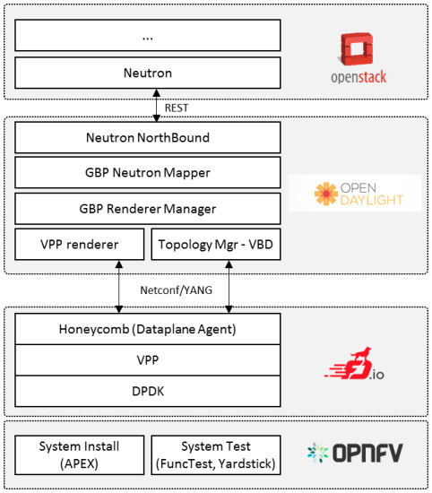

# NFV

NFV (Network Functions Virtualization)是一种使用x86等通用硬件来承载传统网络设备功能的技术。

## NFV架构

* NFV VIM (Virtualised Infrastructure Manager)，包括虚拟化（hypervisor或container）以及物理资源（服务器、交换机、存储设备等）
* NFV-O (Network Functions Virtualisation Orchestrator)，NFV的管理和编排，包括自动化交付、按需提供资源以及VNF配置（包括物理和虚拟资源）
* VNF (Virtual Network Function)

参考[NFV specifications by ETSI](http://www.etsi.org/technologies-clusters/technologies/nfv)。

## OPNFV (Open Platform for NFV)

* <https://www.opnfv.org/>
* <https://fd.io>
* <https://www.opendaylight.org/>

## ONAP (Open Network Automation Platform)

ONAP项目是由AT&T主导下的ECOMP（增强控制、编排、管理和策略）项目和中国三大运营商主导下的Open-O项目合并而成，旨在帮助电信行业克服在MANO领域遇到的一些障碍，加快NFV的部署，降低将VNF纳入到网络中的时间和成本。

ONAP官方网站为<https://www.onap.org/>.

## OpenStack Tacker

* <https://wiki.openstack.org/wiki/Tacker>
* [Redhat solution for network functions virtualization](https://access.redhat.com/documentation/en-us/red_hat_openstack_platform/8/html-single/red_hat_solution_for_network_functions_virtualization/)

## ETSI OSM

OSM是ETSI开源的NFV MANO (Management and Orchestration)。

OSM官方网站为<https://osm.etsi.org/>

## CORD (Central Office Re-architected as a Datacenter)

CORD (Central Office Re-architected as a Datacenter) combines NFV, SDN, and the elasticity of commodity clouds to bring datacenter economics and cloud agility to the Telco Central Office. CORD lets the operator manage their Central Offices using declarative modeling languages for agile, real-time configuration of new customer services. Major service providers like AT&T, SK Telecom, Verizon, China Unicom and NTT Communications are already supporting CORD.

http://opencord.org/

## ONOS

http://onosproject.org/

## 其他项目

* OpenMANO - https://github.com/nfvlabs/openmano
* Openbaton
* Cloudify
* Clearwater vIMS
* Gohan
