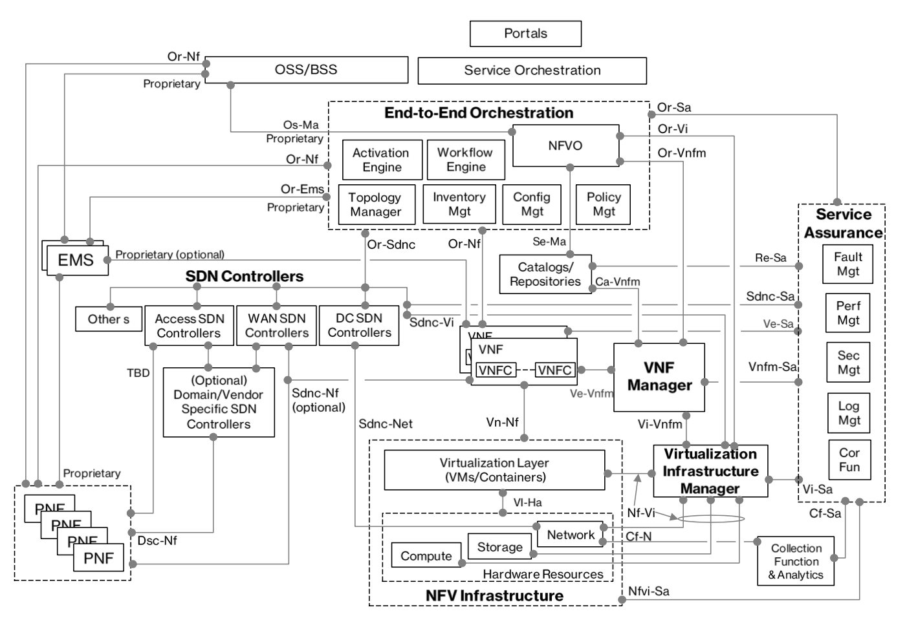

# NFV

NFV (Network Functions Virtualization)是一种使用x86等通用硬件来承载传统网络设备功能的技术。它是通过用软件和自动化替代专用网络设备来定义、创建和管理网络的新方式。

同SDN一样，NFV从根本上讲是从基于硬件的解决方案转向更开放的基于软件的解决方案。例如，取代专用防火墙设备，软件可以通过虚拟防火墙提供相同的功能。再如入侵检测和入侵防御、NAT、负载均衡、WAN加速、缓存、GGSN、会话边界控制器、DNS等等虚拟网络功能。有时，不同的子功能可以组合起来形成一个更高级的多组件VNF，如虚拟路由器。

正如SDN和NFV可以在廉价的裸机或白盒服务器上的实现方式，这些VNF可以运行在通用的商用硬件组件上，而不是成本高昂的专有设备。网络运营商通过NFV快速实现并应用VNF，并通过业务流程自动化服务交付。

ETSI列出了NFV为网络运营商及其客户提供的几点优势：

- 通过降低设备成本和降低功耗，减少运营商CAPEX和OPEX
- 缩短部署新网络服务的时间
- 提高新服务的投资回报率
- 更灵活的扩大，缩小或发展服务
- 开放虚拟家电市场和纯软件进入者
- 以较低的风险试用和部署新的创新服务

## NFV架构

- NFV VIM (Virtualised Infrastructure Manager)，包括虚拟化（hypervisor或container）以及物理资源（服务器、交换机、存储设备等）
- NFVO (Network Functions Virtualisation Orchestrator)，NFV的管理和编排，包括自动化交付、按需提供资源以及VNF配置（包括物理和虚拟资源）
- VNF (Virtual Network Function)

## OPNFV (Open Platform for NFV)

[OPNFV](https://www.opnfv.org/)是Linux基金会的开源NFV方案，致力于将其他开源项目通过集成、部署和测试进行系统级的整合，从而搭建一个基准的NFV平台。

## 开源项目

- ONAP (Open Network Automation Platform)
  - 由AT&T主导下的ECOMP（增强控制、编排、管理和策略）项目和中国三大运营商主导下的Open-O项目合并而成
  - 旨在帮助电信行业克服在MANO领域遇到的一些障碍，加快NFV的部署，降低将VNF纳入到网络中的时间和成本
  - 官方网站为<https://www.onap.org/>.
- ETSI OSM
  - ETSI开源的NFV MANO (Management and Orchestration)。
  - 官方网站为<https://osm.etsi.org/>
- OpenStack Tacker
  - 官方网站为<https://wiki.openstack.org/wiki/Tacker>
  - [Redhat solution for network functions virtualization](https://access.redhat.com/documentation/en-us/red_hat_openstack_platform/8/html-single/red_hat_solution_for_network_functions_virtualization/)
- OpenDaylight: <https://www.opendaylight.org/>
- ONOS: <http://onosproject.org/>
- CORD: <http://opencord.org/>
- Openbaton
- Cloudify
- Clearwater vIMS
- Gohan

## 参考文档

- <http://www.etsi.org/>
- <https://www.onap.org/>
- [NFV specifications by ETSI](http://www.etsi.org/technologies-clusters/technologies/nfv)。
- [历数NFV的发展历程](http://www.sdnlab.com/19295.html)
