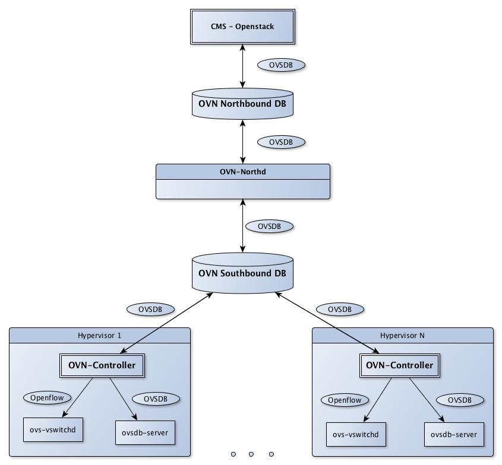

# OVN

## OVN 简介

[OVN (Open Virtual Network)](http://openvswitch.org/support/dist-docs/ovn-architecture.7.html) 是OVS提供的原生虚拟化网络方案，旨在解决传统SDN架构（比如Neutron DVR）的性能问题。其主要功能包括

1. L2/L3虚拟网络以及逻辑交换机(logical switch)
2. L2/L3/L4 ACL
3. IPv4/IPv6分布式L3路由
4. ARP and IPv6 Neighbor Discovery suppression for known IP-MAC bindings
5. Native support for NAT and load balancing using OVS connection tracking
6. Native fully distributed support for DHCP
7. Works with any OVS datapath (such as the default Linux kernel datapath, DPDK, or Hyper-V) that supports all required features (namely Geneve tunnels and OVS connection tracking. See the datapath feature list in the [FAQ](https://github.com/openvswitch/ovs/blob/master/FAQ.md#general) for details.)
8. Supports L3 gateways from logical to physical networks
9. Supports software-based L2 gateways
10. Supports TOR (Top of Rack) based L2 gateways that implement the hardware_vtep schema
11. Can provide networking for both VMs and containers running inside of those VMs, without a second layer of overlay networking

## OVN架构

OVN由以下组件构成：

* northbound database：存储逻辑交换机、路由器、ACL、端口等的信息，目前基于ovsdb-server，未来可能会支持etcd v3
* ovn-northd: 集中式控制器，负责把northbound database数据分发到各个ovn-controller
* ovn-controller: 运行在每台机器上的本地SDN控制器
* southbound database：基于ovsdb-server（未来可能会支持etcd v3），包含三类数据
  * 物理网络数据，比如VM的IP地址和隧道封装格式
  * 逻辑网络数据，比如报文转发方式
  * 物理网络和逻辑网络的绑定关系



补充说明

* Data Path：OVN的实现简单有效，都是基于OVS原生的功能特性来做的（由于OVN的实现不依赖于内核特性，这些功能在OVS+DPDK上也完全支持），比如
  * security policies 基于 OVS+conntrack 实现
  * 分布式L3路由基于OVS flow实现
* Logical Flows：逻辑流表，会由ovn-northd分发给每台机器的ovn-controller，然后ovn-controller再把它们转换为物理流表
* 更多架构可以参考[Open Virtual Network architecture](http://openvswitch.org/support/dist-docs/ovn-architecture.7.html)

## OVN安装

如果想要安装master版本，可以使用<https://copr.fedorainfracloud.org/coprs/leifmadsen/ovs-master/>的BUILD：

### CentOS

```sh
wget -o /etc/yum.repos.d/ovs-master.repo https://copr.fedorainfracloud.org/coprs/leifmadsen/ovs-master/repo/epel-7/leifmadsen-ovs-master-epel-7.repo
yum install openvswitch openvswitch-ovn-*
```

### Ubuntu

```sh
apt-get install -y openvswitch-switch ovn-central ovn-common ovn-controller-vtep ovn-docker ovn-host
```

注：DPDK版本见<https://copr.fedorainfracloud.org/coprs/pmatilai/dpdk-snapshot/>。

## 启动ovn

控制节点：


```sh
# start ovsdb-server
/usr/share/openvswitch/scripts/ovs-ctl start --system-id=random

# start ovn northd
/usr/share/openvswitch/scripts/ovn-ctl start_northd

export CENTRAL_IP=10.140.0.2
export LOCAL_IP=10.140.0.2
export ENCAP_TYPE=vxlan
ovs-vsctl set Open_vSwitch . external_ids:ovn-remote="tcp:$CENTRAL_IP:6642" external_ids:ovn-nb="tcp:$CENTRAL_IP:6641" external_ids:ovn-encap-ip=$LOCAL_IP external_ids:ovn-encap-type="$ENCAP_TYPE"
```

计算节点：

```sh
# start ovsdb-server
/usr/share/openvswitch/scripts/ovs-ctl start --system-id=random
# start ovn-controller and vtep
/usr/share/openvswitch/scripts/ovn-ctl start_controller
/usr/share/openvswitch/scripts/ovn-ctl start_controller_vtep

export CENTRAL_IP=10.140.0.2
export LOCAL_IP=10.140.0.2
export ENCAP_TYPE=vxlan
ovs-vsctl set Open_vSwitch . external_ids:ovn-remote="tcp:$CENTRAL_IP:6642" external_ids:ovn-nb="tcp:$CENTRAL_IP:6641" external_ids:ovn-encap-ip=$LOCAL_IP external_ids:ovn-encap-type="$ENCAP_TYPE"
```

对于ovs 1.7，还需要设置

```sh
ovn-nbctl set-connection ptcp:6641
ovn-sbctl set-connection ptcp:6642
```

