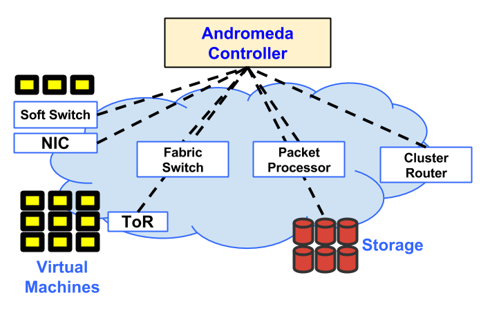
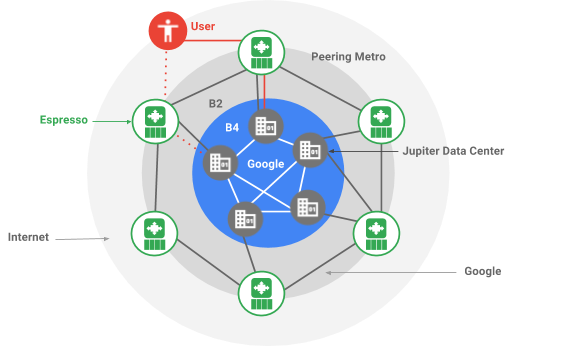
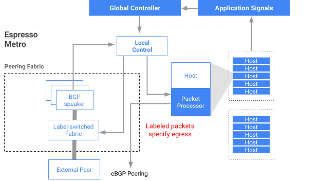

# Google Data Center Networks

## Jupiter

Google通过SDN的途径来构建Jupiter，Jupiter是一个能够支持超过10万台服务器规模的数据中心互联架构。它支持超过1 Pb/s的总带宽来承载其服务。

## Andromeda

Google Andromeda是一个网络功能虚拟化（NFV）堆栈，通过融合软件定义网络(SDN)和网络功能虚拟化(NFV)，Andromeda能够提供分布式拒绝服务(DDoS)攻击保护、透明的服务负载均衡、访问控制列表和防火墙。

## Espresso

Espresso将SDN扩展到Google网络的对等边缘，连接到全球其他网络。Espresso使得Google根据网络连接实时性的测量动态智能化地为个人用户提供服务。

> “根据其IP地址（或DNS解析器的IP地址），我们动态选择最佳网络接入点，并根据实际的性能数据重新平衡流量，而不是选择一个静态点。”

Expresso在与标签交换结构相同的服务器上运行边界网关协议（BGP）。分组处理器将标签插入每个数据包。路由器读取标签后，每个城市的本地控制器都可以编写标签交换结构。服务器向全局控制器发送流量实时的情况简报。通过这种途径，本地控制器可以实时更新，全球控制器可以集成所有区域。

## B4

Google构建B4网络实现了数据中心的连接，以便在各个校园网之间实时复制数据。B4是基于白盒交换机建立的，受谷歌开发的软件控制。Google的目标是建立一个复制网络，随着它的成长，逐渐承载关键的网络任务。B4的增长速度比我们的公共网络快。

**参考链接**

- <https://cloudplatform.googleblog.com/2015/06/A-Look-Inside-Googles-Data-Center-Networks.html>
- <https://cloudplatform.googleblog.com/2014/04/enter-andromeda-zone-google-cloud-platforms-latest-networking-stack.html>
- <https://blog.google/topics/google-cloud/making-google-cloud-faster-more-available-and-cost-effective-extending-sdn-public-internet-espresso/>
- <https://people.eecs.berkeley.edu/~sylvia/cs268-2014/papers/b4-sigcomm13.pdf>
