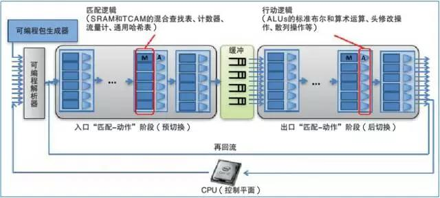

# SDN数据平面

数据平面负责数据处理、转发和状态收集等。其核心设备为交换机，可以是物理交换机，也可以是虚拟交换机。不同于传统网络转发设备，应用于SDN中的转发设备将数据平面与控制平面完全解耦，所有数据包的控制策略由远端的控制器通过南向接口协议下发，网络的配置管理同样也由控制器完成，这大大提高了网络管控的效率。交换设备只保留数据平面，专注于数据包的高速转发，降低了交换设备的复杂度。

本质上来说，决定SDN可编程能力的因素在于数据平面的可编程性，所以就有了通用可编程数据平面OpenFlow Switch。通用可编程数据平面支持用户通过软件编程的方式任意定义数据平面的能力，包括数据包的解析、处理等功能。

从OpenFlow Switch通用转发模型诞生至今，学术界和产业界在通用可编程数据平面领域做了很多努力，持续推动了SDN数据平面的发展。其中典型的通用可编程数据平面设计思路是The McKeown Group的可编程协议无关交换机架构PISA（Protocol-Independent Switch Architecture）。到达PISA系统的数据包先由可编程解析器解析，再通过入口侧一系列的Match-Action阶段，然后经由队列系统交换，由出口Match-Action阶段再次处理，最后重新组装发送到输出端口。

## SDN数据平面发展历史

- 早期的软件交换机，如Open vSwitch、Indigo等，一般存在性能问题
- 随后的可编程硬件，如基于NetFPGA的OpenFlow交换机，成本高，开发难度大，灵活性差
- 中期的OpenFlow网络设备，如Pica8、Cumulus、Big Switch等在现有网络交换机操作系统上增加了对OpenFlow南向接口的支持，还有博通、盛科等网络芯片厂商在网络交换机芯片上实现了对OpenFlow南向接口和OpenFlow Switch通用转发模型的支持
- 现阶段通用可编程网络芯片和数据平面编程语言的出现进一步推动SDN数据平面的发展，如The McKeown Group的PISA (Protocol Independent Switch Architecture) 架构以及Barefoot发布的基于PISA的可编程网络芯片Tofino。现阶段数据平面的编程语言代表为P4。

## 参考文档

- [Barefoot Tofino](https://barefootnetworks.com/technology/#tofino)
- [P4 Language](http://p4.org/)
- 《重构网络-SDN架构与实现》
- [基于SDN的数据中心网络技术研究](http://www.sdnlab.com/10543.html)
