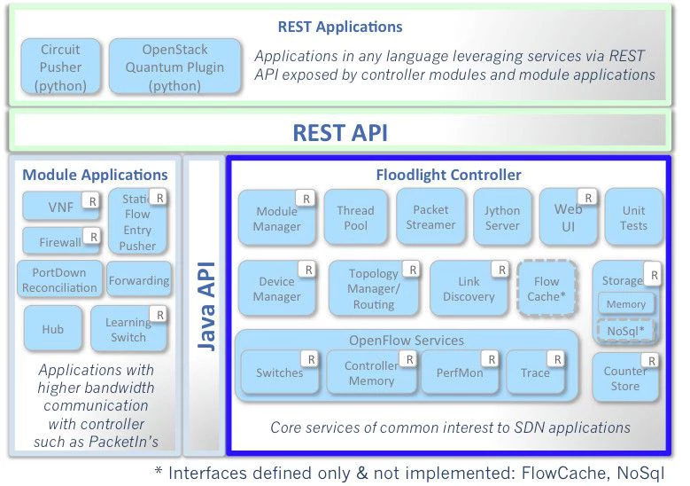

# Floodlight

Floodlight是BigSwitch在Beacon基础上开发的SDN控制器，它基于Java开发，具有良好的架构和性能，也是早期最流行的SDN控制器之一。

Floodlight的架构可以分为控制层和应用层，应用层通过北向API与控制层通信；控制层则通过南向接口控制数据平面。

Floodlight模块结果如下所示：

由于Floodlight更新迭代速度较慢，特别是OpenDaylight诞生以后，Floodlight已经丧失了

## 参考文档

- [Floodlight官网](http://www.projectfloodlight.org/floodlight/)
- [Project Floodlight](https://floodlight.atlassian.net/wiki/)
