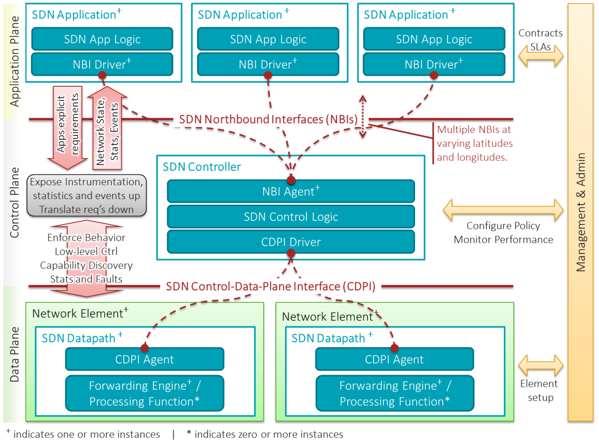
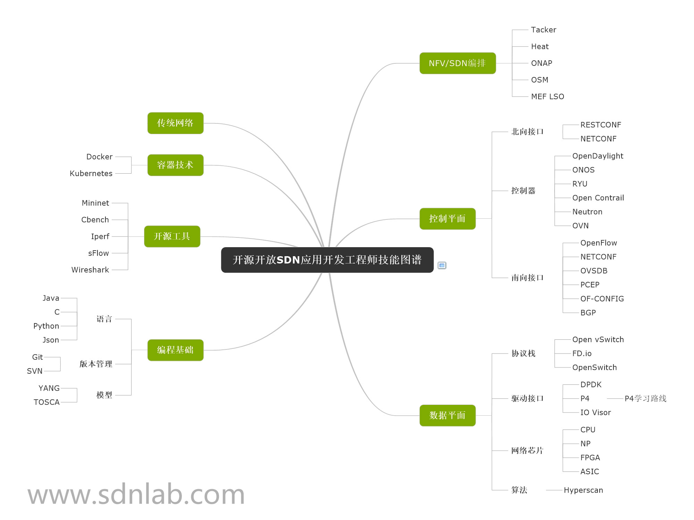

# SDN网络

SDN（Software Defined Network）自诞生以来就非常火热，它是一种新的网络设计理念，即控制与转发分离、集中控制并且开放API。一般称控制器开放的API为北向接口，而控制器与底层网络之间的接口为南向接口。南北向接口目前都还没有统一的标准，但南向接口用的比较多的是OpenFlow，使其成为事实上的标准（曾经也有人认为SDN=OpenFlow）。

与SDN相辅相成的NFV，即网络功能虚拟化，最初主要是电信运营商在推动。NFV借助通用硬件以及虚拟化技术，实现专用网络设备的功能，从而降低网络建设的成本。对应的还一个NV（网络虚拟化）的概念，这是在数据中心将各种不同软硬件网络资源整合为基于软件统一管理的过程，主要是用来虚拟化数据中心网络。

## SDN架构

[ONF (Open Networking Foundation)](https://www.opennetworking.org/index.php)将SDN架构分为三层

- 应用层包括各种不同的业务应用
- 控制层负责数据平面资源的编排、维护网络拓扑和状态信息等
- 数据层负责数据处理、转发和状态收集

## SDN的基本特征

SDN具有三个基本特征

- 控制与转发分离：转发平面由受控转发的设备组成，转发方式以及业务逻辑由运行在分离出去的控制面上的控制应用所控制。
- 开放API：通过开放的南向和北向API，能够实现应用和网络的无缝集成，使得应用只需要关注自身逻辑，而不需要关注底层实现细节。
- 集中控制：逻辑上集中的控制平面能够获得网络资源的全局信息并根据业务需求进行全局调配和优化。

## SDN优势

从SDN的特征出发，SDN的优势包括

- 灵活性，动态调整网络设备的配置，再也不需要人工去配置每台设备
- 网络硬件简化（如白牌交换机等），只需要关注数据的处理和转发，与业务特性解耦，加快了新业务的引入速度
- 网络的自动化部署和运维、故障诊断

## SDN发展历程

- 2006年，Martin Casado博士在RCP和4D论文基础上，提出了一个逻辑上集中控制的企业安全解决方案SANE，打开了集中控制解决安全问题的大门
- 2007年，Martin博士在SANE基础上实现了面向企业网管理的Ethane项目（SDN架构和OpenFlow的前身），Nick、Scott和Martin一起创建Nicira
- 2008年，网络领域八位学者联合发表了OpenFlow论文，Nick团队发布了第一个开源SDN控制器NOX
- 2009年，SDN入选麻省理工科技评论的 “未来十大突破性技术”，Nick团队发布POX以及FlowVisor，Nicira发布Open vSwitch，James Liao和杜林共同创办了Pica8公司
- 2010年，Nick团队发布Mininet，Google发布分布式SDN控制器Onix，Nick的博士Guido等创办了BigSwitch，前思科员工JR等创办了Cumulus
- 2011年，开放网络基金会ONF诞生，第一届开放网络峰会ONS成功举办，Nick McKeown、Scott Shenker、Larry Peterson等创建了开放网络研究中心ONRC，这是ON.Lab的前身
- 2012年，Google发布B4，VMWare天价收购Nicira，BigSwitch发布Floodlight，NTT发布Ryu
- 2013年，OpenDaylight项目诞生，思科发布ACI产品方案，VMWare发布NSX产品
- 2014年，ONOS、P4等诞生。Facebook在OCP项目中开放发布Wedge交换机设计细节，白盒交换机成为这一年的主旋律。
- 2015年，ONF发布了一个开源SDN项目社区，SD-WAN成为第二个成熟的SDN应用市场。SDN与NFV融合成为趋势
- 2016年，国内的云杉网络、大河云联、盛科网络以及国外的VeloCloud、Plexxi、Cumulus 和BigSwitch都获得了新一轮融资
- 2017年，鹏博士正式发布运行国内首个运营商级SD-WAN

## SDN技能图谱

## 参考文档

- <https://www.opennetworking.org/index.php>
- [漫谈SDN大历史](http://www.sdnlab.com/18601.html)
