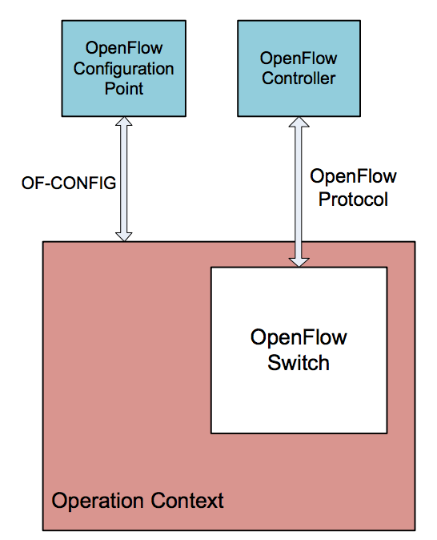
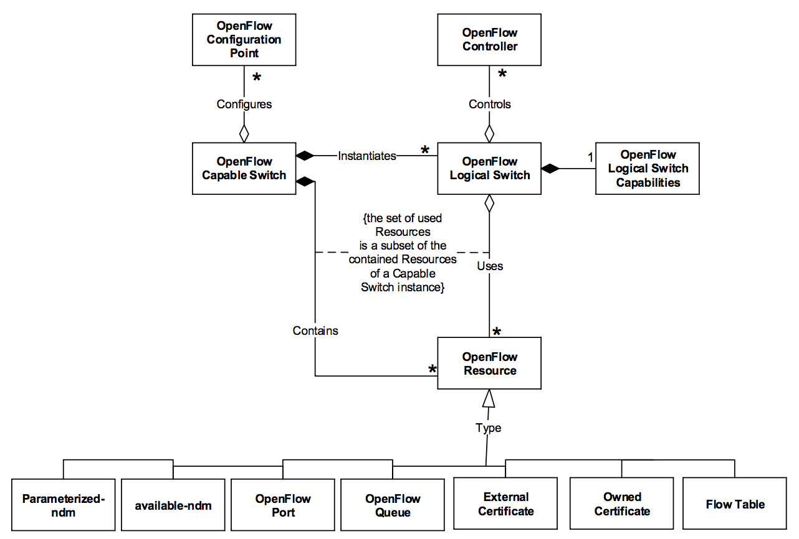

# OF-Config

OF-Config是一个OpenFlow交换机配置协议，也是ONF主推的OpenFlow补充协议，很好的填补了OpenFlow协议之外的交换机运维配置等内容。它提供了开放接口用于控制和配置OpenFlow交换机，但不影响流表的内容和数据转发行为。OF-CONFIG在OpenFlow架构上增加了一个被称作OpenFlow Configuration Point的配置节点。这个节点既可以是控制器上的一个软件进程，也可以是传统的网管设备。

OF-Config的协议规范也发布在[ONF官方网站](https://www.opennetworking.org/technical-communities/areas/specification)。

OF-Config基于NET-CONF与设备通信，其核心数据结构如下所示。

