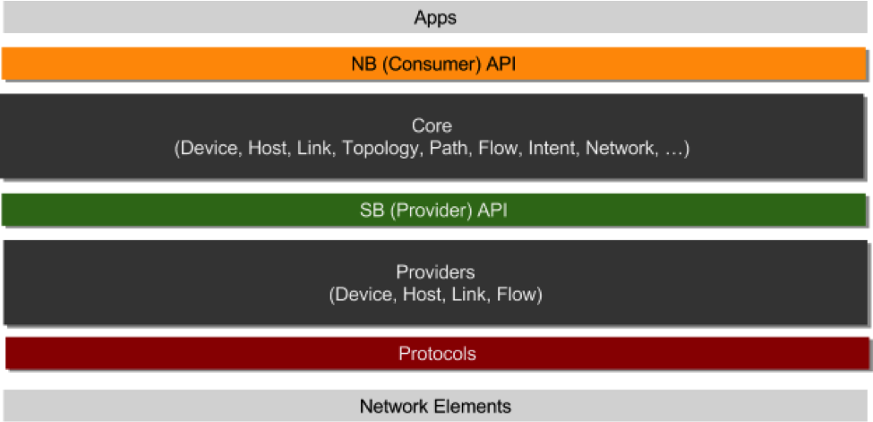
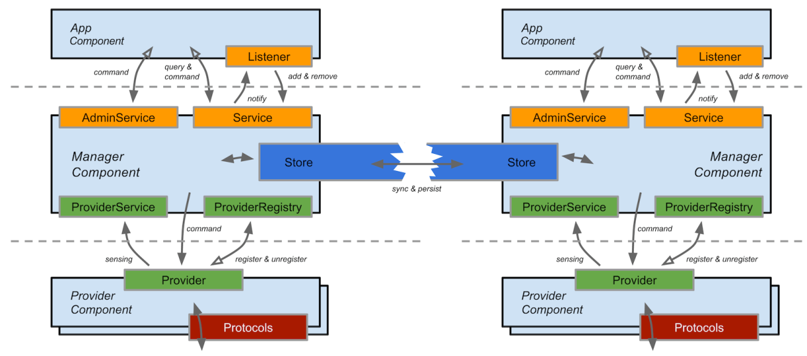

# ONOS

[ONOS](http://onosproject.org/)是一个开源SDN网络操作系统，主要面向服务提供商和企业骨干网。ONOS的设计宗旨是满足网络需求实现可靠性强，性能好，灵活度高等特性。此外，ONOS的北向接口抽象层和API使得应用开发变得更加简单，而通过南向接口抽象层和接口则可以管控OpenFlow或者传统设备。ONOS集聚了知名的服务提供商（AT&T、NTT通信），高标准的网络供应商（Ciena、Ericsson、Fujitsu、Huawei、Intel、NEC），网络运营商（Internet2、CNIT、CREATE-NET），以及其他合作伙伴（SRI、Infoblox），并且获得ONF的鼎力支持，通过一些真实用例来验证其系统架构。

## ONOS架构

### 系统层次

### 组件和服务

- 模块化： ONOS由一系列功能模块组成，每个功能模块由一个或者多个组件组成，对外提供一种特定服务，这种基于SOA的框架同时支持对组件的全生命周期管理，支持动态加载、卸载组件
- 开放：ONOS提供开放的北向与南向API，使得用户能够很方便的基于ONOS开发应用以及南向插件。
- 抽象：ONOS 抽象出了统一的网络资源和网元模型奠定了第三方SDN应用程序互通的基础，使得运营商可以做灵活的业务协同和低成本业务创新。
- 简单：ONOS屏蔽了复杂的分布式等通用机制，对外只暴露业务接口，使得应用开发十分简单。 

### ONOS集群

- 分布式: 由多个实例组成一个集群
- 对称性: 每一个实例运行相同的软件和配置
- 容错与弹性扩展: 集群在面对节点故障时仍然可操作，支持新节点动态加入，轻松应对网络扩张
- 位置透明: 一个客户端可以和任何实例打交道，集群要展现单个逻辑实例的抽象
- ONOS集群间通信: 分为两种，一种基于Gossip协议，是数据弱一致性的通信方式；一种基于Raft算法，是保证数据强一致性的通信方式
- 高可靠：ONOS的Cluster机制能够保障节点失效对业务无影响，当ONOS节点宕机时，其他节点会接管该节点对网元的控制权，当节点恢复后，通过loadbalance命令恢复节点对网元的控制并使整体的控制达到负载均衡 

## 参考文档

- [ONOS Website](http://onosproject.org/)
- [ONOS Wiki](https://wiki.onosproject.org)
- [ONOS架构分析](http://developer.huawei.com/ict/cn/site-sdn-onos/article/onos-paradigm)
- [ONOS白皮书上篇之ONOS简介](http://www.sdnlab.com/6371.html)
- [ONOS白皮书中篇之ONOS架构](http://www.sdnlab.com/6800.html)
