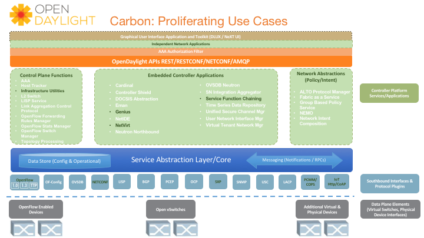

# OpenDaylight

[OpenDaylight](https://www.opendaylight.org/)是Linux基金会管理的开源SDN控制器，依托强大的社区支持和功能特性，已成为最受瞩目的开源SDN控制器。

OpenDaylight(ODL)高度模块化、可扩展、可升级、支持多协议。北向接口可扩展性强，REST型API用于松耦合应用，OSGI型用于紧耦合应用。引入SAL屏蔽不同协议的差异性。南向支持多种协议插件，如OpenFlow 1.0、 OpenFlow 1.3、OVSDB、NETCONF、LISP、BGP、PCEP和SNMP等。底层支持传统交换机、纯Openflow交换机、混合模式的交换机。ODL控制平台采用了OSGI框架，实现了模块化和可扩展化，为OSGI模块和服务提供了版本和周期管理。ODL靠社区的力量驱动发，支持工业级最广的SDN和NFV使用用例。ODL每6个月推出一个版本，经历的版本为Hydrogen、Helium、Lithium、Beryllium、Boron、Carbon等。

## 架构

如下图所示，OpenDaylight架构分为南向接口层、控制平面层、北向接口层和网络应用层。

- 南向接口层：包含多种协议插件，如OpenFlow 1.0、 OpenFlow 1.3、OVSDB、NETCONF、LISP、BGP、PCEP和SNMP等。南向接口层使用Netty来管理底层的并发IO
- 控制平面层：包含MD-SAL、网络功能、网络服务和网络抽象等模块，其中MD-SAL（Model Driven Service Abstraction Layer）是OpenDaylight的核心，所有模块都需要向其注册才可使用。MD-SAL也是整个控制器的管理中心，负责数据存储、请求路由、消息的订阅和发布等
- 北向接口层：包含开放API接口（包括REST API和OSGI）和认证模块
- 网络应用层：包含各种基于OpenDaylight北向接口层的各种应用集合，如Management GUI/CLI、VTN Coordinator、D4A Protection和OpenStack Neutron等

## 参考文档

- [OpenDaylight官网](https://www.opendaylight.org/)
- [OpenDaylight Handbook](http://docs.opendaylight.org/en/stable-carbon/)
- [OpenDaylight Wiki](https://wiki.opendaylight.org/view/Main_Page)
- [OpenDaylight控制器架构分析](http://www.sdnlab.com/community/article/4)
- 《重构网络-SDN架构与实现》
