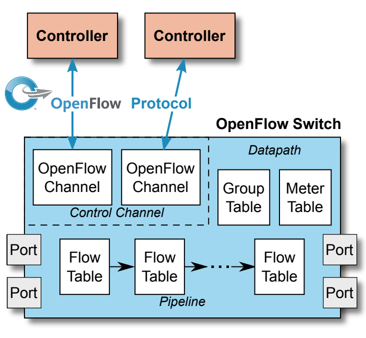
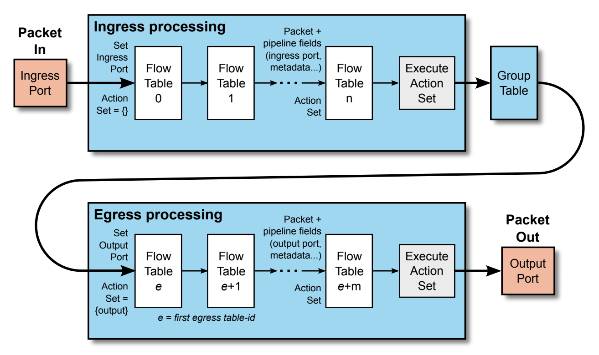
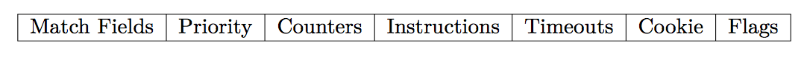
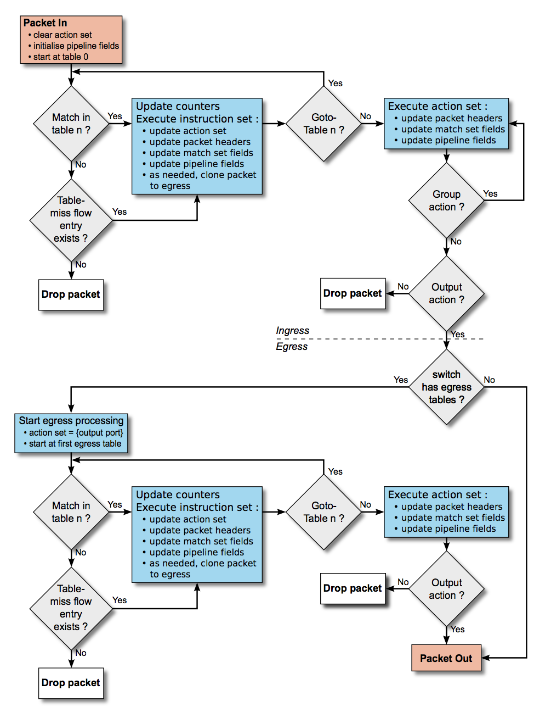
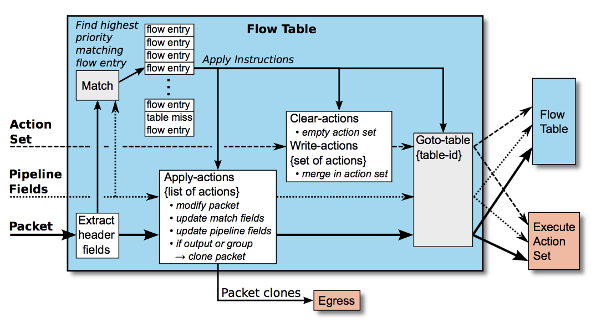
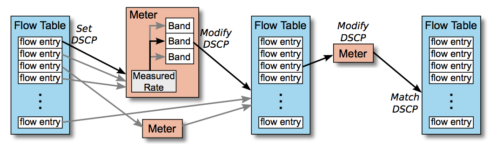

# OpenFlow

[OpenFlow](https://www.opennetworking.org/sdn-resources/openflow)是第一个开放的南向接口协议，也是目前最流行的南向协议。它提出了控制与转发分离的架构，规定了SDN转发设备的基本组件和功能要求，以及与控制器通信的协议。

OpenFlow起源于Nick McKeown等在2008年发表的[OpenFlow: enabling innovation in campus networks](http://dl.acm.org/citation.cfm?id=1355734.1355746)论文，并在次年发布了1.0版本协议。2011年又成立了Open Networking Foundation (ONF)进一步规范和推动OpenFlow的发展，并将OpenFlow的协议规范发布在[ONF网站](https://www.opennetworking.org/technical-communities/areas/specification)。

## OpenFlow原理

OpenFlow协议规范定义了OpenFlow交换机、流表、OpenFlow通道以及OpenFlow交换协议。

### OpenFlow交换机

一个典型的OpenFlow交换机如下图所示

它主要由OpenFlow通道和数据平面组成，而数据平面又包括流表、端口、组表和Meter表等：

- OpenFlow通道用于交换机和控制器进行通信（基于OpenFlow交换协议）
- 流表即存放流表项的表
- 端口是OpenFlow与其他网络协议栈进行数据交换的网络接口，包括物理端口、逻辑端口以及预留端口等
- 组表用于定义一组可被多个流表项共同使用的动作
- Meter表用于计量和限速

### 流表

流表用于存储流表项，多级流表以流水线的方式处理。

每个流表项由匹配域（包括输入端口、包头以及其他流表设置的元数据）、优先级、指令集、计数器、计时器、Cookie和用于管理流表项的flag组成：

一个典型的流表匹配过程如下所示

而典型的指令执行过程如下所示

除了流表，还可以定义Meter表

### OpenFlow通道

OpenFlow通道是控制器和交换机通信的通道。控制器可以通过该通道来配置和管理交换机、接收交换机发出的事件等。OpenFlow通道使用OpenFlow交换协议（OpenFlow switch protocol），通常基于TLS通信，但也支持直接TCP通信。

OpenFlow交换协议支持三种类型的报文

- controller-to-switch：控制器初始化并下发给交换机的报文，用于管理和查询交换机状态（如查询交换机特性，修改交换机流表、组表等）
- asynchronous：交换机异步发送给控制器的报文，用于更新网络事件和交换机状态的改变（如新报文到达、交换机端口变化等）
- symmetric：交换机或控制器发送，但无需对方许可，如Hello协商、Echo活性测试、Error错误报文等

## 参考文档

- [OpenFlow官方网站](https://www.opennetworking.org/sdn-resources/openflow)
- [OpenFlow协议规范](https://www.opennetworking.org/technical-communities/areas/specification)
