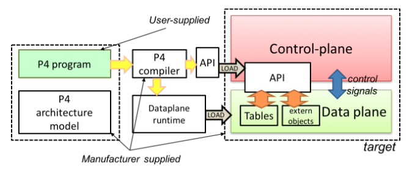
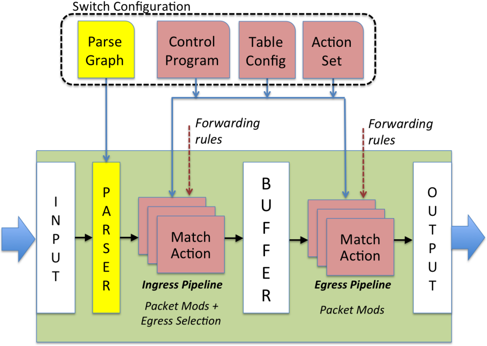
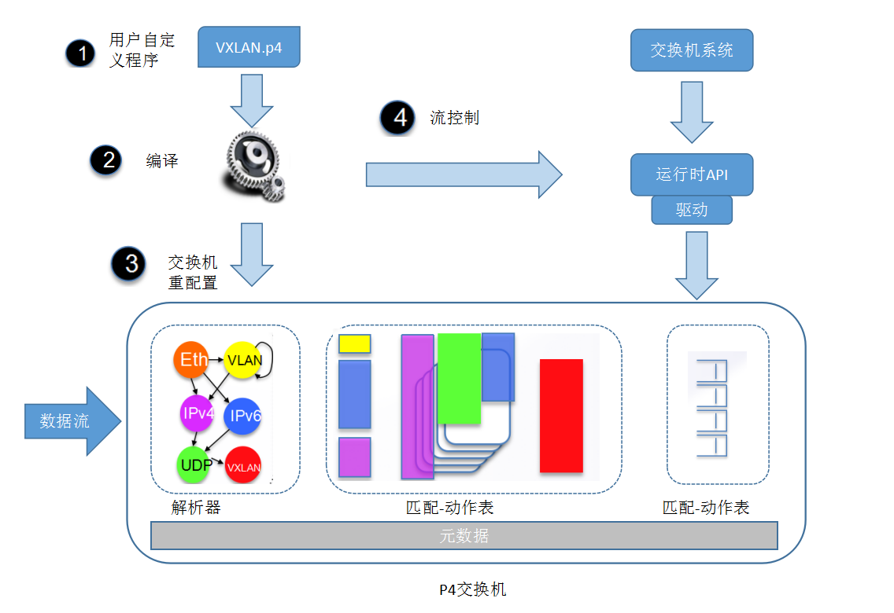

# P4

[P4](http://p4.org/)是一个协议无关的数据包处理编程语言，提供了比OpenFlow更出色的编程能力。它不仅可以指导数据流进行转发，还可以对交换机等转发设备的数据处理流程进行编程。主要特点包括

- 灵活定义数据转发流程，支持重新配置匹配域，并支持无中断的重配置
- 协议无关，只需要关注如何处理转发包，而不需要关注底层协议细节
- 设备无关，无需关注底层设备的具体信息

## 转发模型

如下图所示，数据包经过解析后，会被传递到一个“匹配-动作”表，并支持串行和并行操作。类似于OpenFlow流水线，这些表决定了数据包将被送往哪里，如丢弃或送到某个出端口。P4的流水线分为入口流水线和出口流水线：

- 入口流水线中，数据包可能会被转发、复制、丢弃或触发流量控制
- 而出口流水线可以对数据包作进一步的修改，并送到相应的出端口

P4交换机将流水线处理数据的过程进行抽象和重定义，数据处理单元对数据的处理抽象成匹配和执行匹配-动作表的过程，包头的解析抽象成P4中的解析器，数据处理流程抽象成流控制。P4基础数据处理单元是不记录数据的，所以就需要引入一个元数据总线，用来存储一条流水线处理过程中需要记录的数据。P4交换机的专用物理芯片Tofino，最高支持12个数据处理单元，可以覆盖传统交换机的所有功能。

## P4语言

每个P4程序包含如下的5个关键组件：

- Headers：定义报文头部格式，支持重定义的头部名称和任意长度字段
- Parses：定义数据包解析流程的有限状态机
- Tables：“匹配-动作”表，定义匹配域以及对应的执行动作
- Actions：动作指令集，包括构造查找键（Construct lookup keys）、根据查找键查表、执行动作等
- Control Flow：控制程序，决定了数据包处理的流程，比如如何在不同表之间跳转等

具体的编写方法可以参考[P4 Language Specification](https://p4lang.github.io/p4-spec/docs/P4-16-v1.0.0-spec.html)。

## P4工作流程

P4的完整工作流程为：

- 首先用户需要自定义数据帧的解析器和流控制程序
- 然后，P4程序经过编译器编译后输出JSON格式的交换机配置文件和运行时的API
- 再次配置的文件载入到交换器中后更新解析起和匹配－动作表
- 最后交换机操作系统按照流控制程序进行包的查表操作

以新增VLAN包解析为例，图中解析器除VXLAN以外的包解析是交换机中已有的，载入VXLAN.p4文件所得的配置文件的过程就是交换机的重配置过程。配置文件载入交换机后，解析器中会新增对VXLAN包解析，同时更新匹配-动作表，匹配成功后执行的动作也是在用户自定的程序中指定。执行动作需要交换机系统调用执行动作对应的指令来完成，这时交换机系统调用的是经过P4编译器生成的统一的运行时API，这个API就是交换机系统调用芯片功能的驱动，流控制程序就是指定API对应的交换机指令。

## 参考文档

- [P4](http://p4.org/)
- [P4:开创数据平面可编程时代](http://www.sdnlab.com/17795.html)
